### 데이터베이스의 발전
 
- 오프라인 관리
- 종이에 연필로 기록해 장부로 관리
- 파일시스템 사용
- 컴퓨터 파일에 기록/저장 - 메모장, 엑셀 활용
- 컴퓨터에 저장된 파일의 내용은 읽고, 쓰기가 편한 약속된 형태의 구조 사용
- 데이터 중복으로 인한 불일치 문제
- 데이터베이스 관리시스템 (DBMS)
- 파일시스템의 단점 보완
- 대량의 데이터를 보다 효율적으로 관리하고 운영

### 계층형 DBMS
- 처음으로 나온 DBMS 개념 - 1960년대에 시작
- 레코드들을 계층구조로 표현한 데이터 모델 사용
- 검색 빠르지만, 구조 변경 어렵고, 데이터 중복 문제 발생

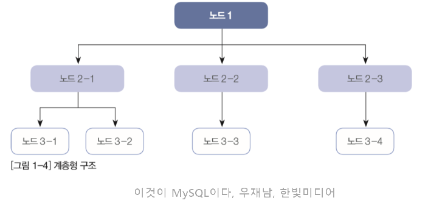

### 네트워크형 DBMS
- 레코드 타입과 링크(Pointer들의 집합)로 구성
- 복잡한 내부 포인터 사용
- 프로그래머가 이 모든 구조를 이해해야만 프로그램의 작성 가능

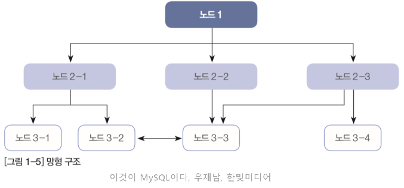

### 관계형 DMBS
- 논리적 구조가 Table 형태
- Oracle, DB2, Informix, Sybase, MS SQL Server, MySQL
- 속성값 사용

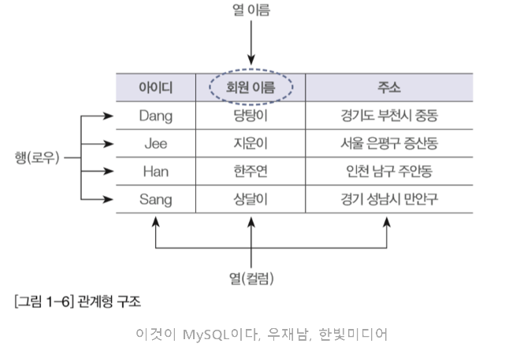

### NoSQL 데이터베이스
- Not Only SQL
- SQL을 사용하지 않는다는 의미 (단어 해석)
- SQL이 필요 없다는 의미가 아니고, 개선/ 보안의 의미
- 관계형 데이터베이스보다 덜 제한적인 일관성 모델을 이용
- 키(key)와 값(value)형태로 저장
- 키를 사용해 데이터 관리 및 접근
- MongoDB

## 관계형 데이터베이스
### 관계형 데이터 모델
- 데이터를 2차원 테이블 형태인 릴레이션 구조로 표현하는 논리적 데이터 모델

### 릴레이션 (테이블)
- 관계형 데이터 구조
- 데이터를 원자 값(Atomic Value)으로 갖는 2차원의 테이블로 표현
- 논리적 구조이므로 다양한 정렬 기준을 통하여 릴레이션 표현 가능

### 릴레이션(테이블) 스키마 – 구조
- 릴레이션에 데이터를 넣을 수 있도록 하는 릴레이션 틀
- 릴레이션(테이블) 이름, 속성(열) 이름, 속성값의 도메인 정의

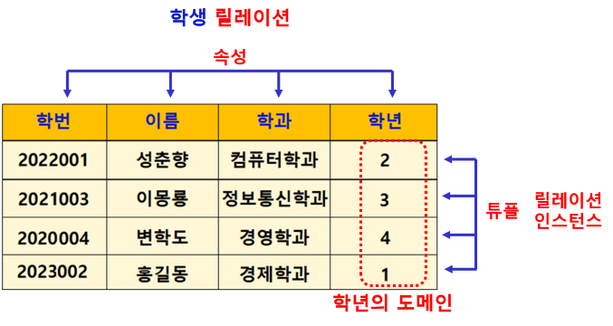

### 속성 (Attribute)
- 데이터베이스를 구성하는 가장 작은 논리적 단위
- 테이블의 열 (Column)
- 개체의 특성, 상태 등 기술
- 파일 구조의 데이터 필드에 해당
- 속성 : 학번, 이름, 학과, 학년

### 도메인 (Domain)
- 테이블에서 하나의 속성(열)이 취할 수 있는 같은 타입의 원자(Atomic)값들의 집합
- 예: [학년] 속성의 경우 도메인은 1~4
- 실제 속성값이 나타날 때 속성값의 적법 여부를 검사하는데 이용
- 예 : [성별] 속성의 경우 도메인은 ‘남자’, ‘여자’

### 릴레이션 스키마의 표현
- 테이블 이름 (속성1, 속성2, 속성3, 속성4)
- 예 : 학생(학번, 이름, 학과, 학년)
 
### 릴레이션 인스턴스
- 어느 시점의 테이블에 들어 있는 행들의 집합
- 테이블의 행 들의 집합
- 동적성질 (삽입, 삭제, 갱신으로 시간에 따라 변함)

### 행 (튜플)
- 테이블의 행 (Row) (데이터 행)
- 테이블 내의 모든 행은 서로 중복되어서는 안됨
- 최소 하나의 열은 달라야 함 - 기본키
- 2023001 홍길동 1 010-1234-1234
- 2023002 홍길동 1 010-1234-1234

### 릴레이션(테이블)의 특징
- 속성(열)은 단일 값을 가진다
- 속성은 서로 다른 이름을 가진다
- 한 속성의 값은 모두 같은 도메인 값을 가진다
- 속성(열)의 순서는 상관없다
- 릴레이션(테이블) 내의 중복된 튜플(행)은 허용하지 않는다
- 튜플(행)의 순서는 상관없다

### 속성(열)의 특징
#### 속성(열)은 단일 값을 가진다
- 각 속성의 값은 도메인에 정의된 값만을 가지며 그 값은 모두 단일 값이어야 한다
- 한 속성은 2개 이상의 값을 가질 수 없다

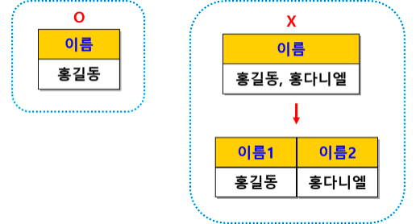

#### 속성(열)은 서로 다른 이름을 가진다
- 속성은 한 테이블에서 서로 다른 이름을 가져야만 한다
- 동일한 이름의 속성명이 존재해서는 안 된다

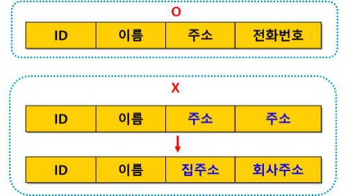

#### 한 속성의 값은 모두 같은 도메인 값을 가진다
- 한 속성에 속한 열은 모두 그 속성에서 정의한 도메인 값만 가질 수 있다

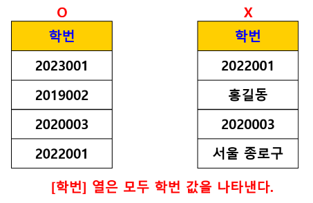

#### 속성(열)의 순서는 상관없다
- 속성의 순서가 달라도 테이블의 스키마는 같다
- 열의 순서를 변경하더라도 이 관계의 내용은 전혀 변하지 않는다
- (이름, 학과) 순을 (학과, 이름) 순으로 표시해도 상관 없다

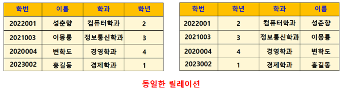

#### 튜플(행)의 순서는 상관없다
- 행의 순서가 달라도 같은 테이블이다
- 관계 데이터 모델의 튜플은 실제적인 값을 가지고 있으며 이 값은 시간이 지남에 따라 데이터의 삭제, 수정, 삽입에 따라 순서가 바뀔 수 있다

#### 테이블 내의 중복된 행은 허용하지 않는다
- 하나의 릴레이션 인스턴스(행) 내에서는 서로 중복된 값을 가질 수 없다
- 모든 행은 서로 값이 달라야 한다
- 각 튜플(행)을 서로 다르게 구별 짓는 속성 - 기본키

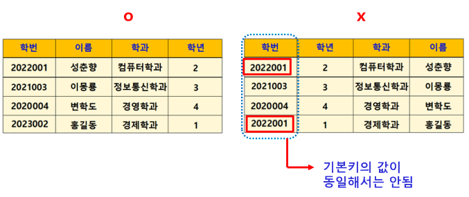

---
### 제약 (Constraints)
- 데이터베이스에 저장되는 데이터에 대한 규칙
- 데이터베이스의 기본 구조를 유지하고,
- 현실세계에서 데이터가 갖는 의미를 보다 정확하게 표현하고,
- 데이터의 오류를 방지하기 위한 중요한 수단
- 데이터 무결성을 유지하기 위한 방법

### 관계 데이터 제약
- 키
- 무결성 제약 조건

### 키 (Key)
- 릴레이션(테이블)을 구성하는 각 튜플(행)을 속성(열)값에 의해 유일하게 식별할 수 있게 해주는 속성(열) 또는 속성(열)의 집합
- 릴레이션은 중복된 튜플(행)을 허용하지 않기 때문에 각각의 튜플(행)에 포함된 속성(열)들 중 어느 하나(혹은 하나 이상)는 값이 달라야 한다

### 키의 종류
- 기본키
- 외래키
- 후보키
- 대체키
- 복합키

### 기본키 (주 키, Primary Key, PK)
- 한 릴레이션(테이블)에서 모든 튜플(행)을 유일하게 구별할 수 있는 수 있는 속성(열)
- NULL 값은 허용하지 않는다 (NOT NULL)
- 키 값의 변동이 일어나지 않아야 한다
- 중복을 허용하지 않는다

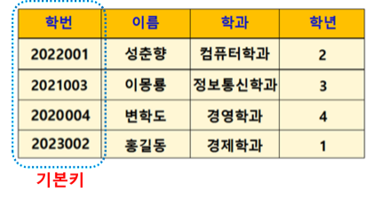

### 외래키 (Foreign Key, FK)
- 다른 릴레이션(테이블)의 기본키를 참조하는 속성(열)
- 릴레이션 간의 관계(relationship) 표현에 사용
- 참조하고(외래키) 참조되는(기본키) 양쪽 릴레이션의 도메인은 서로 동일
- 참조되는(기본키) 값이 변경되면 참조하는(외래키) 값도 변경
- NULL 값과 중복값 허용

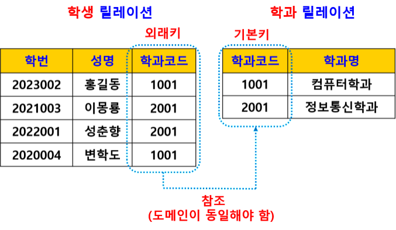

### 복합키
- 여러 개의 속성(열)을 묶어서 기본키로 사용하는 키

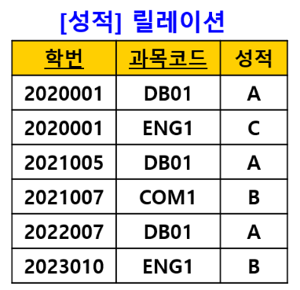