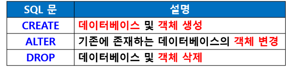
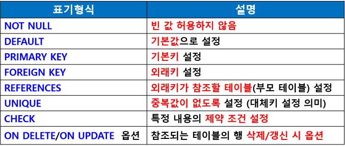
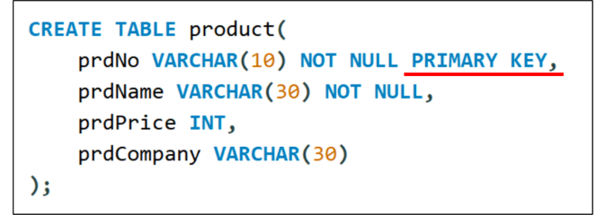
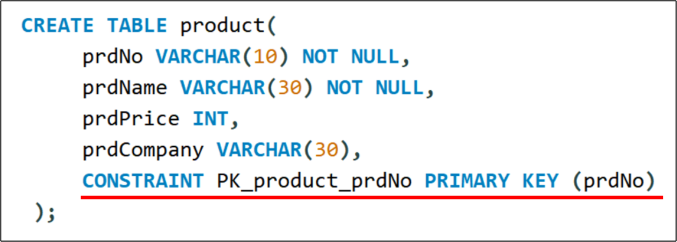

## DDL (데이터 정의어 : Data Definition Language)

- 데이터베이스 구조 정의를 위한 언어
- 데이터베이스 구조, 데이터 형식, 접근 방식 등 데이터베이스/테이블 구축 및 변경
- 데이터베이스의 논리적, 물리적 구조 정의 및 변경
- 스키마 (Schema)에 사용되는 제약 조건 명시
- 스키마 : 데이터베이스의 전체 구조 명시
- 데이터의 물리적 순서 규정
- CREATE / ALTER / DROP 명령문



### CREATE 문
- 테이블, 도메인, 뷰, 스키마 구조 정의
- 스키마 생성 / 삭제
```sql
CREATE SCHEMA
DROP SCHEMA
```

#### CREATE TABLE
- 테이블 구성
- 속성과 속성에 관한 제약 정의
    - 기본키
    - 외래키

#### CREATE 문의 기본 형식
```sql
CREATE TABLE 테이블명(
    열이름 데이터타입(크기) [제약조건]
);
```

- 제약조건



#### PRIMARY KEY 제약조건
- 기본키 제약조건
- 열에 지정
- 중복 안 됨
- 빈 값 안 됨

- 제약 조건 방법 1



- 제약 조건 방법 2



#### 복합키 설정 
```sql
PRIMARY KEY(속성1, 속성2)
CONSTRAINT PK_prduct_prdNo PRIMARY KEY (속성1, 속성2)
```

### 외래키가 2개 이상인 경우
외래키 수만큼 설정
```sql
CONSTRAINT FK_department_no FOREIGN KEY (depNo) REFERENCES department2 (depNo)
CONSTRAINT fk_product_category FOREIGN KEY (ctgID) REFERENCES category(ctgID)
```

### ALTER 문
- 테이블의 정의 변경
- 새로운 열 추가, 특정 열의 디폴트 값 변경, 특정 열 삭제 등 수행

#### ALTER 문의 기본 형식
- ALTERE TABLE
ADD : 열 추가
- RENAME COLUMN : 열의 이름 변경
- MODIFY : 열의 데이터 형식 변경
- CHANGE : 열의 이름과 데이터 형식 변경
- DROP COLUMN : 열 삭제
- DROP : 여러 개의 열 삭제
- DROP PRIMARY KEY : 기본키 삭제 
- DROP CONSTRAINT : 제약조건 삭제

### 기본키 / 외래키 삭제
- ALTER TABLE 테이블명 DROP PRIMARY KEY;
- ALTER TABLE 테이블명 DROP FOREIGN KEY 키이름;
- ALTER TABLE 테이블명 DROP CONSTRAINT 키이름;

기본키 / 외래키 추가
- ALTER TABLE 테이블명 ADD PRIMARY KEY (열이름);
- ALTER TABLE 테이블명 ADD CONSTRAINT 키이름 PRIMARY KEY (열이름);
- ALTER TABLE 테이블명 ADD FOREIGN KEY (열이름) REFERENCES 참조테이블명 (기본키 열이름);
- ALTER TABLE 테이블명 ADD CONSTRAINT 외래키명   FOREIGN KEY (열이름) REFERENCES 참조테이블명 (기본키 열이름);

#### ON DELETE CASCADE
- 기준 테이블의 데이터가 삭제되었을 때
외래키로 지정된 테이블(참조하는 테이블)의 데이터도 자동으로 삭제되도록 설정

### DROP 문
- 테이블 삭제 
- DROP TABLE;
테이블 구조와 - 데이터 모두 삭제
(뒤에서 DML에서 데이터만 삭제 시 DELETE문 사용)