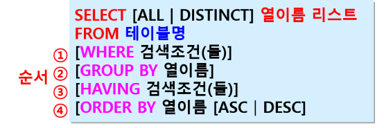
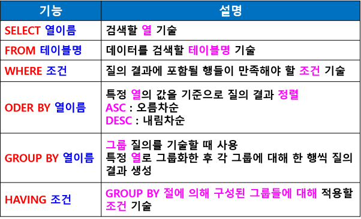
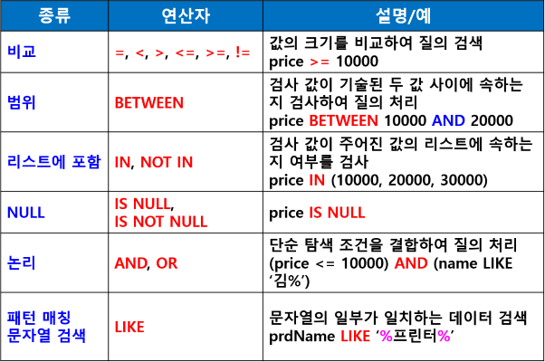
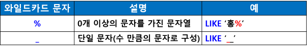
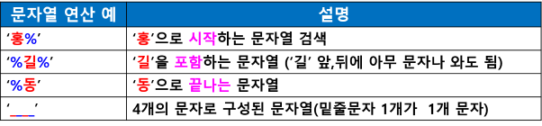

## DML (데이터 조작어 : Data Manipulation Language)

- 데이터 처리를 위해 응용프로그램과 데이터베이스 관리 시스템 간의 인터페이스를 위한 언어
- 데이터 처리 연산 기능
- 삽입 / 삭제 / 갱신 / 검색 연산등
- INSERT / DELETE / UPDATE / SELECT

### INSERT 문
- 테이블에 새로운 행을 삽입하는 명령어
기본 형식
```sql
INSERT INTO 테이블명(열이름 리스트) VALUES(값 리스트)

-- ex
INSERT INTO student(stdNo, stdName, stdYear) VALUES(‘2023001’, ‘홍길동’, 1)
```

### UPDATE 문
- 특정 열의 값을 수정하는 명령어
조건에 맞는 행을 찾아서 열의 값 수정
```sql
UPDATE 테이블명 SET 열=값 WHERE 조건;

-- ex
UPDATE product SET prdName= ‘UHD TV’  WHERE predNo=’5’;
```

### DELETE 문
- 테이블에 있는 기존 행을 삭제하는 명령어
기본 형식
```sql
DELETE FROM 테이블명 WHERE 조건;

-- ex
DELETE FROM product WHERE prdName=’그늘막 텐트;

-- 테이블의 모든 행 삭제
DELETE FROM product;
```

### SELECT 문
- 테이블에서 조건에 맞는 행 검색

- SELECT 문 기본 형식



- SELECT 기능



#### 중복 제거
- '*' :  모든 열 출력
- DISTINCT 
속성값이 중복되는 것이 있으면 한 번만 출력

#### 검색 조건 :  WHERE 조건 
- 비교 (=, <, >, <=, >=, !=)
- 범위 (BETWEEN)
- 리스트에 포함 (IN, NOT IN)
- NULL (IS NULL, IS NOT NULL)
- 논리(AND, OR)
- 패턴 매칭 (LIKE)



- 패턴 매칭 (LIKE)





#### ORDER BY 
- 특정 열의 값을 기준으로 쿼리 결과 정렬
- ASC : 오름차순 (디폴트 : 생략 가능)
- DESC : 내림차순

##### 집계 함수
- SUM() : 합계
- AVG() : 평균
- COUNT() : 선택된 열의 행 수 반환 (null 값 제외)
- COUNT(*) : 전체 행의 수
- MAX() : 최대
- MIN() : 최소

#### GROUP BY
- 그룹 쿼리를 기술할 때 사용
- 특정 열로 그룹화한 후 각 그룹에 대해 한 행씩 쿼리 결과 생성

#### HAVING
- HAVING 검색조건
- GROUP BY 절에 의해 구성된 그룹들에 대해 적용할 조건 기술
- SUM, AVG, MAX, MIN, COUNT 등의 집계함수와 함계 사용
- 주의!
    - 반드시 GROUP BY 절과 같이 사용
    - WHERE 절보다 뒤에 검색조건에는 집계함수가 와야 한다
