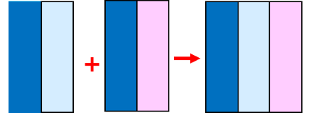
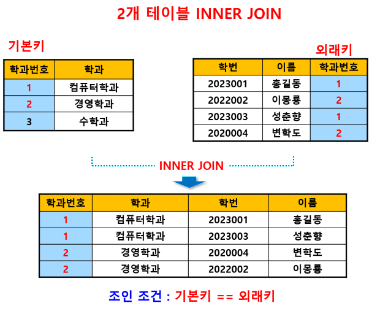
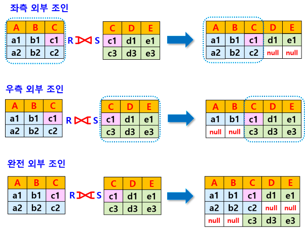
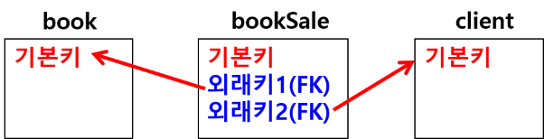

### 조인 (JOIN)
- 여러 개의 테이블을 결합하여 조건에 맞는 행 검색

#### 조인의 종류
- INNER JOIN (내부 조인) : 가장 많이 사용
양쪽 테이블에 공통되는 열이 있을 때

- OUTER JOIN (외부 조인)
공통되는 열이 없을 때

#### INNER JOIN (내부 조인)
- 양쪽 테이블에 공통되는 열이 있을 때 공통 속성의 속성값이 동일한 행만 반환





#### OUTER JOIN (외부 조인)
- 공통되는 열이 없을 때 공통된 속성을 매개로 하는 정보가 없더라도 버리지 않고 연산의 결과를 테이블에 표시
- 좌측 외부 조인 (Left Outer Join)
좌측 테이블의 정보 유지
- 우측 외부 조인 (Right Outer Join)
우측 테이블의 정보 유지
- 완전 외부 조인 (Full Outer Join)
두 테이블의 모든 정보 유지



#### 조인 기본 형식
```sql
SELECT 열리스트
FROM 테이블명1
INNER JOIN 테이블명2
ON 조인조건(기본키=외래키);
```

#### 3개의 테이블 결합
- 조인 조건 2개 

