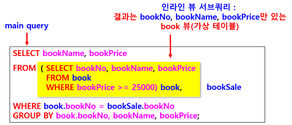

### 서브 쿼리 (Subquery)
- 하위 질의 또는 부속질의 라고도 함
- 하나의 SQL 문 안에 다른 SQL 문이 중첩 (nested)
- 쿼리를 1차 수행한 다음, 수행한 결과의 반환값을 다음 쿼리에 포함시켜서 사용
- 다른 테이블에서 가져온 데이터로 현재 테이블에 있는 정보를 찾거나 가공할 때 사용
- 수행 순서
    - 서브 쿼리 -> 메인 쿼리
    - 서브 쿼리 수행 결과값을 메인 쿼리에서 사용

### 조인 VS 서브 쿼리
#### 조인
- 여러 테이블의 데이터를 모두 합쳐서 연산
- 카티전곱 수행 후 조건에 맞는 행을 검색
- 카티전곱 연산 + SELECT 연산
- 카티전곱 : 테이블1의 모든 행 x 테이블2의 모든 행
    - 15 x 9 = 135행에서 SELECT 연산 수행
    - book(15) x bookSale(9)
#### 서브 쿼리
- 각 테이블에서 필요한 데이터만 찾아서 제공
- bookSale(9) 테이블에서 bookNo 찾고 book(15) 테이블에서 bookNo 찾아서 출력 
- 9 + 15 = 24행을 검색
경우에 따라 조인보다 성능이 더 우수할 수 있지만 서브 쿼리 수행할 때 반드시 우수하다고는 할 수 없음

### 서브 쿼리 
#### 단일 행 서브쿼리
- 서브쿼리 결과 같이 단일 행
- = 연산자 사용
#### 다중 행 서브쿼리
- 서브쿼리 결과 값이 여러 행
- = 연산자 사용 시 오류
IN, ANY, ALL, EXISTS 연산자 사용

#### 서브 쿼리 연산자
- WHERE 절에서 사용
- 데이터를 선택하는 조건 또는 술어와 같이 사용

### IN과 EXISTS의 차이
#### IN
- 서브쿼리에서 조건에 해당되는 행의 열을 비교하여 값 확인
- 서브쿼리 결과 값을 메인 쿼리에 대입하여 조건 비교 후 결과 출력 
#### EXISTS 
- 서브쿼리에서 조건에 해당되는 행의 존재 여부만 확인 (TRUE/FALSE 반환)
- IN에 비해 성능 좋음 (속도 빠름)
- EXISTS 키워드 앞에 속성명, 수식 등이 없음
- WHERE 절에 외래키 제약조건 지정해야 함
- 결과에 NULL 값 포함 
    - IN : 결과에 NULL 값이 포함되지 않음 

### ALL / ANY : 관계 연산자 뒤에 위치
#### ALL
- 검색 조건이 서브쿼리의 결과의 모든 값에 만족하면 참이 되는 연산자 
- 조건 > ALL (서브쿼리 결과)
#### ANY
- 검색 조건이 서브쿼리 결과 중에서 하나 이상에 만족하면 참이 되는 연산자
- 조건 > ANY (서브쿼리 결과)

#### 서브쿼리 유형

#### 스칼라 서브쿼리 (Scalar Subquery)
- SELECT 절에서 사용
- 결과 값을 단일 열(1개 열)의 스칼라 값으로 반환
- 일반적으로 SELECT 문과 UPDATE 문에서 사용

#### 인라인 뷰 (Inline View) 서브쿼리
- FROM 절에서 사용
- 즉, 테이블명 대신 인라인 뷰 서브쿼리 결과(가상 테이블) 사용 (전체 테이블 다 사용하지 않고, 일부분인 가상 테이블 사용)
- 개발 중에 뷰가 필요한 모든 경우에 뷰를 생성하면 관리할 양이 너무 많아 트랜잭션 관리나 성능 상의 문제가 발생할 수 있는 경우 인라인 뷰 사용
    - 실행 순간에 임시의 가상 테이블 생성해서 사용

