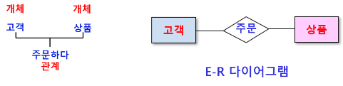
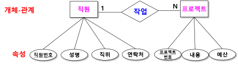
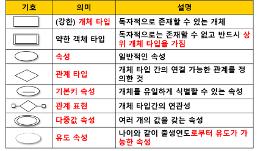
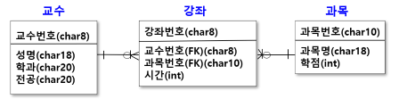
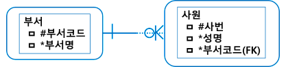

# 개체-관계 모델 개념
- 개체와 개체 간의 관계를 이용해 현실 세계를 개념적으로 표현하는 모델
- 데이터베이스 설계 과정 중 개념적 설계 과정에 사용되는 모델
- 개체와 개체 간의 관계를 E-R 다이어그램이라는 표준화된 그림으로 표현

## E-R 다이어그램 (ERD : Entity Relationship Diagram)
- 개념적 모델링(개체-관계 모델링)의 결과물로 
- 기호를 사용하여 현실 세계를 표현

## ERD 표기법
### 피터 첸 표기법
- 관계에 중점을 둔 표기법
- 쉬운 표기법으로 쉽게 이해
- 속성이 많아지거나 관계가 복잡해지면 표현하기 어려움

#### 피터 첸 표기법의 ERD에서 사용되는 기호

### IE 표기법 
- 정보공학(Information Engineering)에서 사용하는 데이터 모델 표기법
- 까마귀발 모양과 같은 형태의 관계 기호로 표현하기 때문에 Crow's Foot Model이라고도 함
- 많이 사용되는 표기법 중의 하나이지만 개체 집합의 상세 표현에 있어서 공간을 많이 차지하는 단점
- ERWin (데이터 모델링 툴)에서 사용

### Barker 표기법
- 영국 컨설팅 회사 CACI에 의해 처음 개발
- 리차드 바커(Richard Barker)에 의해 지속으로 업그레이드
- 오라클에서 Case Method(Custom Development Method)로 채택하여 사용

