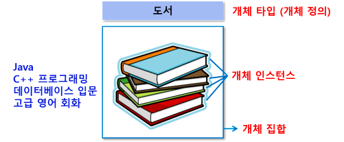
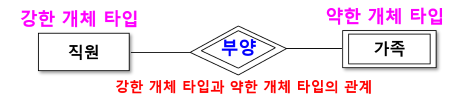
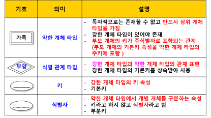
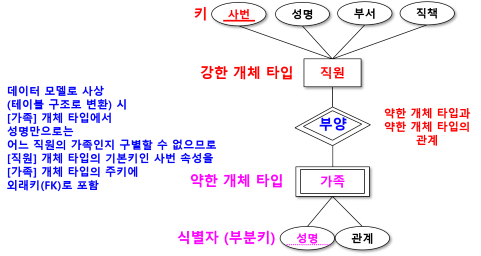

# 개체(entity)
- 사람, 사물, 장소, 개념, 사건과 같이 유무형의 정보를 갖고 있는 독립적인 실체
- 테이블로 생성됨

## 개체의 유형
- 개념적 개체
    - 학과, 과목, 예금 등과 같이 눈에 보이지 않는 개체
- 물리적 개체
    - 사람, 책, 연필 등과 같이 눈에 보이는  개체

## 개체의 특징 
- 유일한 식별자에 의해 식별 가능 
- 꾸준한 관리를 필요로 하는 정보 
- 두 개 이상 영속적으로 존재 
- 업무 프로세스에 이용 
- 반드시 자신의 특징을 나타내는 속성 포함
    - 속성 : 도서명, 저자, 발행일, 출판사 등
- 다른 개체와 최소 한 개 이상의 관계 설정 (관계 없어도 됨)

## 개체 인스턴스 (Entity Instance)
- 하나의 개체

## 개체 집합 (Entity Set)
- 유사한 개체들의 집합
- 동일한 속성을 공유하는 같은 유형의 개체 집합

## 개체 타입 (Entity Type)
- 개체를 정의한 것 
- 테이블명에 해당

## 개체 타입의 유형
### 강한 개체 타입 (Strong Entity Type)
- 다른 개체의 도움 없이 독자적으로 존재할 수 있는 개체
- 일반적으로 개체 타입 하면 강한 개체 타입 의미
### 약한 개체 타입 (Weak Entity Type)
- 독자적으로는 존재할 수 없고 반드시 상위 개체 타입을 갖는 개체

### 약한 개체 타입 관련 기호

### 약한 개체 타입과 식별자 예

### 개체 타입의 E-R 다이어그램 표현
- 직사각형으로 표현