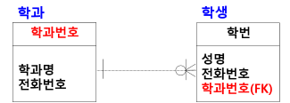

# IE 표기법
- 정보공학(Information Engineering)에서 사용하는 데이터 모델 표기법
- 까마귀발 모양과 같은 형태의 관계 기호로 표현하기 때문에 Crow's Foot Model 이라고도 함

## IE 표기법 기호와 의미

## 대응 수 표기
- 해당 개체 1건에 대한 상대 개체 대응수 표기

## 점선
- 강한 개체 타입
- A가 없어도 B가 존재할 수 있는 관계
- A 개체의 키가 일반 속성으로 포함되는 관계 (FK 키)

## 실선
- 약한 개체 타입
- A가 없으면 B가 존재할 수 없는 관계
- A 개체의 키가 주식별자로 포함되는 관계

## 객체 선택성 표기
- 해당 개체 1건에 대한 상대 개체 선택성 표기

