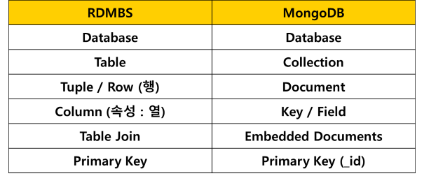
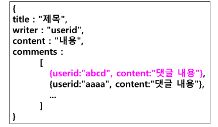

# MongoDB
- NoSQL 방식으로 데이터 구축과 조작을 수행하는 DBMS
- 도큐먼트 지향 스토어 
- 도큐먼트 : 테이블에 해당
- document의 최대 크기가 16MB



- Embedded Documents : 도큐먼트 안에 도큐먼트 포함



## MongoDB 특징
- 테이블 구조가 고정되어 있지 않기 때문에 RDBMS보다 유연하게 데이터를 처리할 수 있음
- 즉, 자유롭게 데이터의 형태를 변경하거나 새로운 필드 추가가 가능
- 데이터 중첩 가능 (임베디드)
- Foreign Key라는 개념이 존재하지 않고, Embedded와 Reference 방식으로 1:N 관계의 데이터 모델링

## MongoDB 사용이 적합한 환경
- (1) 정확한 데이터 구조를 알 수 없거나 
- (2) 스키마다 자주 변경되거나 확장되는 환경
    - (스키마 : 데이터베이스의 구조와 관계를 정의한 구조)
    - 추가될 기능이 확실하지 않고, 상황에 따라 애플리케이션에 저장된 데이터가 지속적으로 달라지는 개발 방법론으로 개발하는 경우
    - 애자일 개발 방법론 또는 나선형 모델의 시제품 만들 때와 같이 최종적인 개발 명세가 확정되지 않는 상황
- (3) 많은 양의 데이터를 처리해야 하는 경우
- (4) 분산 컴퓨팅 환경 : 복제 / 샤딩

## RDBMS가 적합한 환경
- 스키마가 자주 변경되지 않는 경우 
- 관계를 맺고 있는 데이터가 자주 변경되는 경우
    - 즉, 외래키 관계에 있는 테이블의 데이터가 자주 변경되는 경우
    - NoSQL에서는 여러 컬렉션을 수정해야 함

## MongoDB 라이선스
- MongoDB 기능 수정이나 보안 패치 하지 않고 사용한다면 기업도 커뮤니티 에디션 사용 가능
- 그러나 소스 변경/적용 시 DBMS 소스 코드 전체 공개해야 함 (애플리케이션 소스 공개 제외)

## MongoDB 구조
- 도큐먼트 < 컬렉션 < 데이터베이스
- (행 < 테이블 < 데이터베이스)
- 데이터베이스 안에 컬렉션, 컬렉션 안에 도큐먼트 포함

## 도큐먼트 구조
- BSON (Binary JSON) 구조
- 필드와 값
    - {필드1:값1, 필드2:값2, 필드3:{3, 값4}}   
    - 필드 : 문자열만
    - 값 : 문자열, 숫자, 배열, 3차원 위치 좌표, 객체,등 거의 모든 정보 표현 가능

## 데이터베이스 생성
- 데이터베이스 생성
- 컬렉션 생성
- 도큐먼트 생성 

```cmd
<!-- 서버 생성 -->
mongod
<!-- 새로운 cmd 창 -->
mongosh
```

### 데이터베이스, 컬렉션 생성
- db
    - 현재 세팅된 데이터베이스 조회
- use testDB
    - 데이터베이스 생성 
    - testDB>
    - testDB 새로 세팅만 되고 아직 생성되지 않음
- db.createCollection(“member”)
    - 컬렉션 생성
    - db.createCollection(“컬렉션명”)
- show dbs
    - 세팅된 데이터베이스 목록 조회
- show collections
    - 데이터베이스 안에 있는 컬렉션 목록 조회

### 도큐먼ㅌ느 생성
- insertOne() : 도큐먼트 삽입 메소드
- db와 컬렉션이 존재하지 않으면 새로 생성
- db.컬렉션명.insertOne({키:값})
- db.member.insertOne({‘id’:’hong’, ‘passwd’:’1234’, ‘name’:’홍길동’})
- db.member.insertOne({‘id’:’lee’, ‘passwd’:’5678’, ‘name’:’이몽룡’})

### 컬렉션 내 도큐먼트 조회
- db.컬렉션명.find() 
- 결과로는 Cursor 반환
    - 커서 : 쿼리 요청의 결과 값을 가리키는 포인터
- db.member.find()
컬렉션의 모든 데이터(도큐먼트) 출력

## ObjectId
- 컬렉션 안에 도큐먼트 생성할 때마다 기본키로 _id 필드를 자동적으로 생성 
- _id 필드는 서로 겹치지 않은 ObjectId 타입으로 값을 할당 받음 
- ObjectId 값 : 유일한 값
- ObjectId (시간 기기ID 프로세스ID 랜덤카운터값)
- _id 필드 값은 변경가능하지만 삭제하면 다시 자동 생성됨

## 데이터베이스 / 컬렉션 관련 shell 명령어
- 데이터베이스 생성
    - use 데이터베이스명
- 컬렉션 생성 
    - db.createCollection(“컬렉션명”)
- 도큐먼트 생성
    - db.컬렉션명.insertOne({키:값})
    - {키:값} : 도큐먼트
---
- 현재 세팅된 - 데이터베이스 조회 : db
데이터베이스 목록 조회 : show dbs
- 컬렉션 목록 조회 : show collections
---
- 데이터베이스 삭제 : db명.dropDatabase()
- 컬렉션 삭제 : db.컬렉션명.drop()
- 컬렉션 이름 변경 : db.collection.renameCollection(새이름)
데이터베이스 이름은 변경 불가