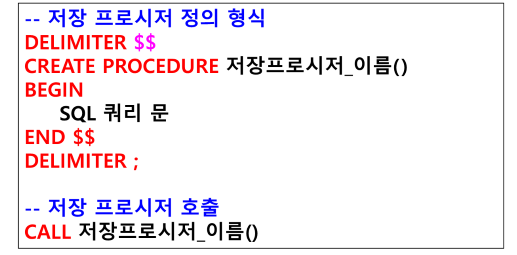

### 저장 프로시저 (Stored Procedure)
- 복잡한 쿼리문 또는 자주 사용되는 쿼리문을 함수로 만들어 놓고 호출해서 사용하는 것 (모듈화 - 기능별)
- 함수 : 매개변수 
    - IN 매개변수
    - OUT 매개변수 
    - IF / CASE 문 사용
    - 변수 선언 

#### 저장 프로시저 정의 형식 



### 저장 프로시저 정의
```sql
DROP PROCEDURE IF EXISTS clientProc;
DELIMITER $$
CREATE PROCEDURE clientProc()
BEGIN
	SELECT * FROM client;
END $$
DELIMITER ;

-- 저장 프로시저 호출
CALL clientProc( );
```

