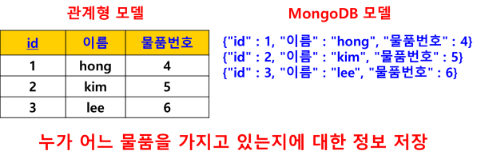
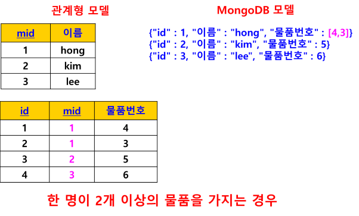

# NoSQL (Not only SQL)
- SQL이 필요 없다는 의미가 아니고, 개선/ 보안의 의미 
- RDBMS(관계형 데이터베이스 관리 시스템)의 문제점 해결을 위해 만들어진 데이터베이스 유형
- RDBMS가 가진 대표적인 문제점 
    - 정규화 사용으로 인해 서비스의 성능이 저하되는 문제
    - (정규화란) 데이터의 중복을 제거하고 무결성을 보장하기 위해 테이블을 분리하여 데이터를 저장하는 방식
    - 데이터를 처리하는 과정에서 분리된 테이블을 결합하는 JOIN이 과도하게 사용되고
    - 웹 서비스의 성능 저하 발생
- 반면 NoSQL은 데이터의 중첩이 허용되기 때문에 불필요한 JOIN을 최소화시킬 수 있고, 데이터 처리 속도 향상 가능
- 소셜 네트워크, 온라인 서비스 등과 같이 대량의 데이터를 신속하게 처리하는 서비스가 많아지면서 NoSQL을 선호됨

## NoSQL DBMS 특징
### (1) 빠른 속도와 확장성
- 2000년대 이후 등장
- 기존 관계형 데이터베이스이 규칙 일부를 포기하는 대신, 뛰어난 확장성과 성능을 발전시키는 방향으로 개발

### (2) 친숙함과 이용의 편리성
- SQL이 아닌 프론트엔드 웹 개발에 친숙한 JavaScript 활용
- 테이블 대신 JSON과 유사한 형태로 저장하는 방식 채용
{id:'1, name:'홍길동', 물품번호:1}

- 관계형  DB와 MongoDB 차이점
    - 한 명이 2개 이상의 물품을 가지는 경우
    - {id:'1, name:'홍길동', 물품번호:[1, 2]}
    - 관계형 모델 : 새로운 테이블 생성. 외래키 제약조건 설정
    - MongoDB 모델 : 값을 배열로 변경

### (3) 쉽고 빠른 분산 컴퓨팅 환경 구성
- 복제(Replicate)와 샤딩(Sharding)을 기본 DBMS 기능으로 제공
- 복제(Replicate) : 데이터베이스 복제. 고가용성 (항상 사용할 수 있는 상태 : 문제 발생 시 복구)
- 샤딩(Sharding) : 여러 대의 서버 데이터베이스에 분산해서 저장하는 방식