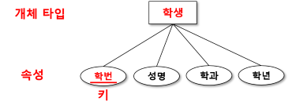
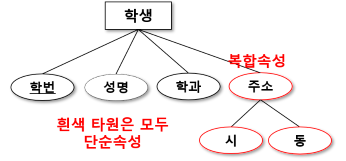

# 속성 (attribute)
- 개체의 성질, 분류, 수량, 상태, 특성, 특징 등의 세부 사항
- 저장할 필요가 있는 개체에 관한 정보
- 학생 : 학번, 성명, 학과, 학년 

# 도메인
- 속성이 가질 수 있는 모든 가능한 값들의 집합
- 예: 
    - 학생 개체 타입의 '성별' 속성인 경우
    - 도메인은 '남' 과 '여'로 제한

## 속성의 ER 다이어그램 표현
- 타원으로 표현
- 개체 타입을 나타내는 직사각형과 실선으로 연결
- 속성의 이름은 타원의 중앙에 표기
- 속성이 개체를 유일하게 식별할 수 있는 키일 경우 속성 이름에 밑줄

## 속성의 유형
- 속성 분해 여부에 따라 분류
    - 단순 속성
    - 복합 속성
- 속성 값의 개수에 따라 분류
    - 단일 값 속성
    - 다중 값 속성

### 속성 분해 여부에 따라 분류
- 단순 속성
    - 더 이상 다른 속성으로 나눌 수 없는 속성

- 복합 속성
    - 2개 이상의 속성들로 분해할 수 있는 속성
    - 독립적인 의미

### 속성 값의 개수에 따라 분류
- 단일 값 속성
    - 반드시 하나의 값만 존재 (예: 학번, 주민등록번호)
- 다중 값 속성
    - 여러 개의 값 존재 가능 (예: 전화번호 - 집, 휴대폰, 회사)

