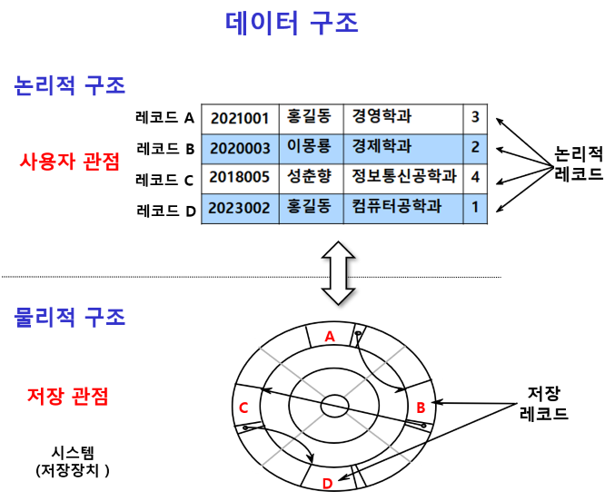
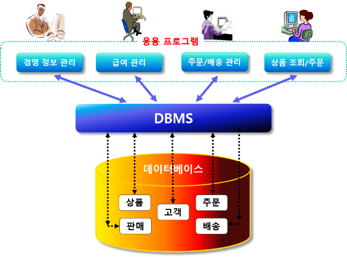
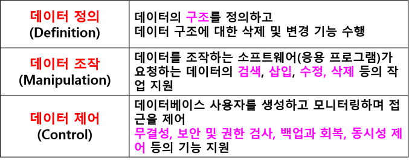

# 데이터베이스 기본 개념

## 데이터
- 관찰이나 측정을 통해 수집된 사실이나 값
- 정량적 또는 정성적인 실제값
## 정보
- 의사결정에 도움이 되도록 데이터를 의미 있는 패턴으로 정리한 것
- 데이터에 의미를 부여한 것
### 데이터 구조
#### 논리적 구조
- 사용자의 관점에서 본 데이터의 개념적 구조
- 데이터의 논리적 배치
- 논리적 레코드
#### 물리적 구조
- 저장 관점에서 본 데이터의 물리적 배치
- 저장장치에 저장된 데이터의 실제 구조
- 물리적 레코드

## 데이터베이스
- 데이터의 집합체
- 조직에 필요한 정보를 얻기 위해 논리적으로 연관된 데이터를 모아서 구조적으로 통합해 놓은 것
- 여러 사용자나 응용프로그램이 공유
- 동시 접근 가능
## 데이터베이스 관리 시스템(DBMS)
- 데이터베이스를 관리해주는 소프트웨어 시스템
- Oracle, MySql, MsSql
## 데이터베이스 시스템
- 통합된 데이터를 관리, 처리 및 사용자에게 서비스하기 위한 전체 시스템

## 데이터베이스 시스템 구성 요소
- 데이터베이스 (DB)
- 데이터베이스 관리 시스템 (DBMS)
- 데이터 언어 (Data Language)
- 사용자 (User)
- 데이터베이스 관리자 (DBA)
- 데이터베이스 컴퓨터 (Database Computer)
- 시스템

데이터베이스 시스템의 구조

## 데이터베이스 / DBMS 특징
- 데이터 공유
- 필요한 자료를 한 번만 데이터베이스에 저장하고 모든 응용프로그램(사용)가 공유
- 데이터 중복 방지, 최신 데이터 유지, 일관성 보장
- 이전의 파일 시스템에서는 응용프로그램에서 데이터를 중복하여 저장/관리 

## 데이터 중복의 최소화
- 동일한 데이터가 여러 개 중복되어 저장되는 것 방지

## 데이터의 독립성
- 데이터베이스 크기 변경하거나 데이터 파일의 저장소 변경 시 기존에 작성된 응용 프로그램에는 영향을 미치지 않도록 데이터의 독립성 보장
- 프로그램과 데이터 분리

## 데이터의 안전성 향상
- 대부분의 DBMS가 제공하는 백업·복원 기능 이용
- 데이터가 손상되는 문제가 발생할 경우 원상으로 복원, 복구하는 방법이 명확

## 데이터의 무결성 (Integrity)
- 데이터베이스 안의 데이터는 오류가 없어야 하고 데이터베이스에 저장된 데이터 값과 표현하는 현실 세계의 실제 값이 일치해야 함
- 데이터가 상호간에 모순성이 없고, 현실 세계에 모순되지 않도록 데이터 유지
- 데이터 무결성 해결 방법 
    - 데이터베이스 시스템에서는 이러한 오류를 방지하기 위해 외래키(FK)를 사용하여 테이블 간의 모순성 배체
- 무결성 제약 조건
    - 무결성을 보장하기 위해 정확하지  않은 데이터가 데이터베이스 내에 저장되는 것을 방지하기 위한 제약 조건
## 보안
- 데이터베이스의 테이블에 따라 접근 권한을 다르게하여 데이터의 베이스의 비밀 유지와 조작 방지

## 데이터 추상화
- 데이터베이스에서는 사용자에게 저장구조의 복잡성을 숨기고 테이블 개념만으로 DB를 생성/관리할 수 있도록 지원

## 데이터베이스 관리 시스템의 기능

