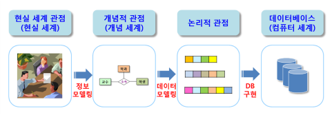
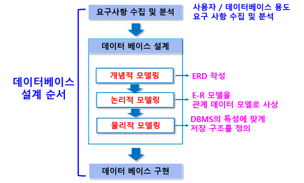
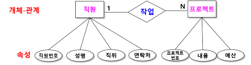
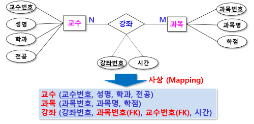
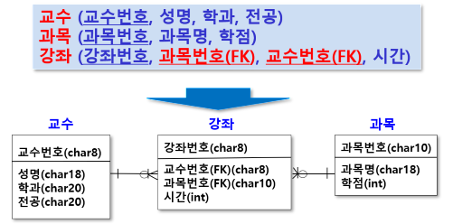

# 데이터 모델링
- 현실 세계에 존재하는 개체의 구성 요소가 가지는 값(데이터)을 컴퓨터 세계에 표현하기 위한
- 현실 세계와 컴퓨터 세계 사이의 변환 과정
- 현실 세계의 복잡한 개념을 단순화/추상화시켜 데이터베이스화하는 기법
- 프로젝트 분석과 설계 단계에서 가장 중요한 작업 중 하나

## 데이터 모델링 과정에서 수행되는 작업
- 데이터베이스 내에 존재하는 데이터 타입 정의
    - 예: 학생, 교수, 학과, 상품, 회원 등 (테이블로 생성)
- 데이터들 사이의 관계 규정
    - 예: 학과와 학생 관계 – 소속(하다/되다)
    - 회원과 상품 관계 – 주문(하다)
- 데이터의 의미와 데이터에 가해진 제약조건 명시
    - 예: 키 제약조건, 참조 무결성 제약조건 등

## 데이터 모델
- 데이터의 관계, 접근과 그 흐름에 필요한 처리 과정에 관한 추상화된 모형
    - 계층형, 네트워크형, 관계형, 객체형, 객체 관계형
- 데이터베이스 설계 과정에서 데이터의 구조를 표현하기 위해 사용
- 현실 세계의 정보를 컴퓨터 세계의 환경에 맞게 표현하기 위해 단순화, 추상화하여 표현 - 개념적

## 데이터 모델링 과정

### 개념적 모델링
- 현실 세계를 추상적 개념인 개체 타입과 관계 타입으로 표현 (테이블 / 테이블과 테이블의 관계 설정)
- 요구사항 분석 결과를 토대로 업무의 핵심적인 개념을 구분하고 개체(entity) 추출, 관계 정의
- ER 다이어그램 (ERD: Entity Relationship Diagram) 이라는 표준화된 그림으로 표현

### 논리적 모델링
- 실제 데이터베이스로 구현하기 위한 모델을 만드는 과정
- 개념적 모델링에서 만든 ER 다이어그램을 사용하고자 하는 DBMS에 맞게 사상(맵핑 : mapping)

#### 논리적 모델링 과정 중 수행 작업
- 개념적 모델링에서 추출하지 않았던 상세 속성 모두 추출
- 정규화 수행
- 데이터 표준화 수행

### 물리적 모델링
- 작성된 논리적 모델을 실제 컴퓨터의 저장 장치에 저장하기 위한 물리적 구조를 정의하는 과정 (데이터 타입과 크기 설정)
- 데이터베이스가 최적의 성능을 낼 수 있도록 DBMS의 특성에 맞게 저장 구조 정의

