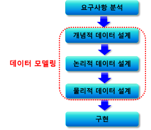

# 데이터베이스 설계 개념

## 데이터베이스 설계
- 사용자의 요구를 분석하여 
- 컴퓨터에 저장할 수 있는  데이터베이스의 구조에 맞게 변경한 후
- 특정 DBMS로 구현하여
- 일반 사용자들이 사용할 수 있게 하는 것

## 데이터베이스 설계 순서

### 요구사항 분석
- 데이터베이스 사용자가 필요로 하는 요구를 분석하고 명세서를 작성하는 단계
- 데이터베이스에 저장되는 내용 정의

### 요구사항 수집 방법
- 실제 문서를 수집하고 분석한다
- 담당자와의 인터뷰나 설문조사를 통해 요구사항을 직접 수렴한다
- 비슷한 업무를 처리하는 기존의 데이터베이스를 분석한다
- 각 업무와 연관된 모든 부분을 살펴본다

## 개념적 데이터 설계
- 정보의 구조를 얻기 위해 현실 세계에 대한 인식을 추상적 개념으로 표현하는 단계
- 데이터 모델 선택하고, 선택한 데이터 모델의 개념 적용함으로써 요구사항들을 데이터베이스의 개념적인 스키마로 변경
- 실제 데이터의 논리적 관계를 도식화하는 과정
- DBMS의 독립적 개념 스키마 설계, 트랜잭션 모델링 및 정의
- E-R 다이어그램 작성

## 논리적 데이터 설계
- 현실 세계에서 발생하는 자료를 컴퓨터가 이해하고 처리할 수 있는 형태로 변화하기 위해 DBMS가 지원하는 논리적 구조로 변환시키는 단계
- 산출된 개체-관계(E-R) 모델을 목표로 하는 DBMS에 맞게 스키마 설계
- 일반적인 구현 데이터 모델은 관계형 데이터 모델
- 개체-관계 모델로 정의된 개념적 스키마를 관계형 스키마로 대응
- 더 좋은 관계 스키마를 만들기 위하여 정규화 과정 수행

## 물리적 데이터 설계
- 데이터베이스의 물리적 속성을 구체화하는 단계
- 논리적 데이터 설계에서 구조화된 데이터베이스를
- 실제 저장 장치에 어떻게 저장할지를 설계하는 단계

## 구현
- 데이터베이스를 실제로 구축하는 과정
- 목표 DBMS의 데이터 정의어(DDL)로 스키마 생성