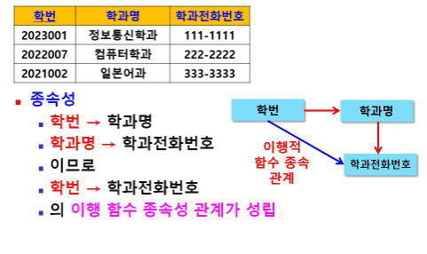

# 정규화
- 이상 현상을 야기하는 속성(Attribute)간의 종속관계를 제거하기 위해 릴레이션을 여러 작은 릴레이션으로 무손실 분해 하는 과정

## 기본 정규화 과정

## 이상 현상 (Anomaly)
- 불필요한 데이터 중복으로 인해 릴레이션에 대한 데이터 삽입/수정/삭제 연산을 수행할 때 발생할 수 있는 부작용

## 이상 현상의 유형
- 삽입 이상 (Insertion Anomaly)
- 갱신 이상 (Update Anomaly)
- 삭제 이상 (Deletion Anomaly)

### 삽입 이상
- 새 데이터 삽입 시, 불필요한 데이터도 함께 삽입해야 하는 문제 발생

### 갱신 이상
- 속성값 갱신 시, 일부만 갱신 되어 데이터 불일치로 인한 문제 발생
    - 속성값이 중복 저장되어 있는 경우
    - 동일한 속성값 중 일부만 갱신되어 데이터의 일관성이 유지되지 않음

### 삭제 이상
- 한 튜플 삭제 시 유지되어야 될 다른 정보도 연쇄 삭제되는 문제 발생

## 이상 현상 예
- 이벤트 참여 릴레이션(테이블)
- 기본키 : 고객아이디+이벤트번호 (복합키)

### 삽입 이상 예
- 새 데이터 삽입 시, 불필요한 데이터도 함께 삽입해야 하는 문제 발생
- 아직 이벤트에 참여하지 않은 신규 고객 등록
    - 고객 아이디 : melon
    - 고객명 : 강길동
    - 등급 : gold 
- 문제 발생
    - 고객 신규등록 상관없는 이벤트 관련 정보도 입력해야 하는 문제 발생
    - 이벤트번호 NULL 값이 들어가서 오류 발생

### 갱신 이상 예
- 속성값 갱신 시, 일부만 갱신 되어 데이터 불일치로 인한 문제 발생
    - 속성값이 중복 저장되어 있는 경우
    - 동일한 속성값 중 일부만 갱신되어 데이터의 일관성이 유지되지 않음
- 갱신 이상 예:
    - 아이디가 ‘apple’인 고객의 등급을 ‘gold’에서 ‘vip’로 변경
    - 일부 튜플만 수정되어 데이터 불일치 문제 발생 

### 삭제 이상 예
- 한 튜플 삭제 시 유지되어야 될 다른 정보도 연쇄 삭제되는 문제 발생
- 삭제 이상 예:
    - 이벤트 참여 취소하여 튜플 삭제 시 이벤트 관련 정보만 삭제되는 것이 아니라 고객 정보도 같이 삭제되는 문제 발생

## 이상 현상 제거
- 이상 현상을 제거하기 위해 정규화 수행

## 정규화 방법
- 함수적 종속성 이용

## 함수적 종속성 (FD: Functional Dependency)
- 속성들간의 관련성
- 데이터들이 어떤 기준값에 의해 종속되는 현상
- 기준값(속성) : 결정자 (Determinant)
- 종속되는 값(속성) : 종속자 (Dependent)
- 예: (학년)은 (학번)에 종속되어 있음
    - 학생(학번, 성명, 학년, …)
- 함수적 종속성을 판단하여 정규화 수행
    - 릴레이션을 연관성이 있는 속성들로만 구성되도록 분해하여 이상 현상이 발생하지 않는 바람직한 릴레이션으로 만듦

## 함수적 종속성 표현
- 릴레이션 R에서 속성들의 부분집합 X와 Y에 대해
    - X → Y 
    - X: 결정자, Y: 종속자
    - ‘Y가 X에 함수적으로 종속되어 있다’
    - ‘X가 Y를 함수적으로 결정한다’
- 의미 : 속성 X를 이용하여 속성 Y를 식별할 수 있다는 의미

## 함수적 종속 관계 판단

## 함수적 종속 다이어그램
- 함수적 종속 관계를 도식화하여 표현한 것

## 함수적 종속 관계를 릴레이션 스키마에 표시

### 함수적 종속성 판단 예
- 이벤트 참여 릴레이션

## 함수 종속성 
- 완전 함수 종속 (FFD: Full Functional Dependency)
- 부분 함수 종속 (PFD: Partial Functional Dependency)

## 완전 함수 종속 (FFD: Full Functional Dependency)
- 릴레이션에서 속성 집합 Y가 속성 집합 X에 함수적으로 종속되어 있지만
- 속성 집합 X의 일부분에는 종속되어 있지 않은 경우의 종속 (전체에 종속)
- 예: {고객아이디, 이벤트번호} → 당첨여부
- 당첨여부는 {고객아이디, 이벤트번호}에 완전 함수 종속됨

## 부분 함수 종속 (PFD: Partial Functional Dependency)
- 릴레이션에서 속성 집합 Y가 속성 집합 X의 전체가 아닌 일부분에 함수적으로 종속되어 있는 경우
- 예: 고객아이디→ 고객성명
- 고객성명은 {고객아이디, 이벤트번호}에 부분 함수 종속되어 있음

### 이벤트 참여 릴레이션 스키마에 종속 관계 표시

## 이행적 함수 종속성
- 한 릴레이션의 속성 X, Y, Z가 주어졌을 때
- 함수적 종속성 X ->Y와 Y->Z가 성립되면
논리적 결과로 Z->X가 성립된다 
- 이때 ‘Z는 X에 이행함수 종속된다’

### 이행 함수 종속성 예

### 릴레이션 스키마에 이행 함수 종속 관계 표시

---

## 정규화의 필요성
- 저장 공간 최소화하고
- 자료간의 불일치성 최소화하고
- 자료 구조의 안정성 최대화하고
- 자료의 삽입, 갱신 및 삭제에 따른 이상 현상 제거하고
- 어떠한 릴레이션이라도 데이터베이스 내에서 표현이 가능하도록 하고
- 검색 알고리즘을 효과적으로 만들기 위해

## 정규화의 단점
- 릴레이션(테이블) 여러 테이블로 분리했기 때문에 데이터 처리 시 조인 작업 필요
- 과다한 조인 작업으로 인해 성능 저하 문제 발생 

## 정규화에 사용되는 이론
- 함수적 종속성 (제2정규형, 제3정규형)
- 다중값 종속성 (제4정규형)
- 결합 종속성 (제5정규형)

## 정규형(NF: Normal Form)
- 릴레이션이 정규화된 정도 (정규화 작업 후 결과)
- 각 정규형마다 제약 조건 존재
- 정규형의 차수가 높아질수록 요구되는 제약 조건이 많아지고 엄격해짐
- 릴레이션의 특성을 고려하여 적합한 정규형 선택

---
## 제1정규화 과정 (비정규형 ->제1정규형(1NF))

### 비정규형 릴레이션을 제1정규형으로 정규화
- 모든 속성(Attribute)이 원자값(Atomic value)만을 갖도록 함
- 예 : 다중값 속성을 포함하는 이벤트참여 릴레이션

### 비정규형 -> 제1정규형(1NF)으로 정규화 방법
- 다중값 속성 제거 – 원자값만 갖게 함
- 정규화 결과 : 제1정규형을 만족하는 릴레이션

## 제1정규형 (1NF)
- 릴레이션에 속한 모든 속성이 원자값만을 갖는 릴레이션 
- 제1정규형을 만족해야 관계형 데이터베이스의 릴레이션이 될 자격이 있음

### 제1정규형은 만족하지만 이상 현상 발생
- 데이터 중복으로 인한 이상 현상 발생

### 제1정규형은 만족하지만 이상 현상이 발생하는 이유
- 기본키에 완전 함수 종속되지 못하고, 부 분 함수 종속되는 속성이 존재하기 때문

### 해결 방법
- 부분 함수 종속성 제거
- 현재 고객 데이터와 이벤트참여 데이터가 이벤트참여 릴레이션 하나로 구성되어 있는데 하나의 이벤트참여 릴레이션을 고객 릴레이션과 이벤트참여 릴레이션으로 분해
- 분해된 릴레이션은 모두 제2정규형에 속하게 됨

## 제2정규화 과정 (제1정규형 -> 제2정규형)

## 제1정규형 릴레이션을 제2정규형(2NF)으로 정규화
- 기본키가 아닌 모든 속성이 기본키에 완전 함수 종속되도록 부분 함수 종속성 제거 (릴레이션 분해)

## 제2정규형 (2NF)
- 릴레이션이 제1정규형에 속하고, 기본키가 아닌 모든 속성이 기본키에 완전 종속되는 릴레이션
- 고객 릴레이션과 이벤트참여 릴레이션 모두 제2정규형에 속함

## 제2정규형은 만족하지만 이상 현상 발생
- 삽입이상 (새로운 등급만 등록 시 기본키인 고객아이디 없어서 오류 발생) 
- 갱신이상 (gold 등급을 15%로 갱신 시 중복되는 데이터 불일치)
- 삭제이상 (한 고객 탈퇴 시 등급 정보도 같이 삭제)

### 제2정규형은 만족하지만 이상 현상이 발생하는 이유
- 이행적 함수 종속성이 존재하기 때문
- X → Y와 Y → Z가 존재하면
- X → Z 성립

### 해결 방법
- 이행 함수 종속성 제거
- 고객 릴레이션 분해
- 분해된 릴레이션은 제3정규형에 속하게 됨

### 제2정규형 릴레이션을 제3정규형으로 정규화
- 이행적 함수 종속성 제거 (릴레이션 분해)

## 제3정규형 (3NF)
- 릴레이션이 제2정규형에 속하고, 기본키가 아닌 모든 속성이 기본키에 이행적 함수 종속되지 않는 릴레이션