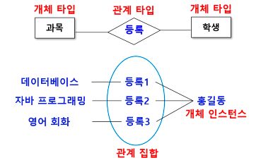
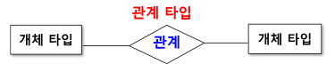
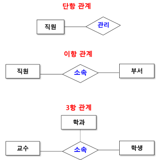
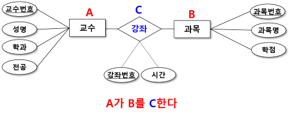
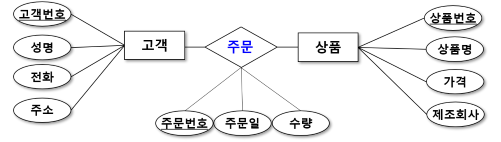
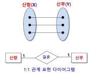
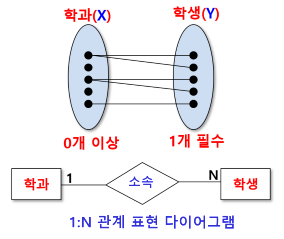
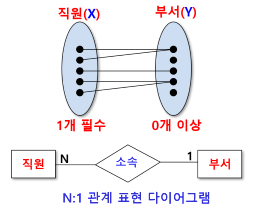
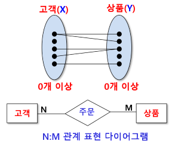

# 관계 (Relationship)
- 2개 이상의 개체 사이에 존재하는 연관성

## 관계 타입 (Relationship Type)
- 개체 타입과 개체 타입 간의 연결 가능한 관계를 정의한 것
- 테이블로 생성됨

## 관계 집합 (Relationship Set)
- 관계로 연결된 집합

## 관계 타입의 ER 다이어그램 표현
- 마름모 모양으로 표시

## 관계의 유형
- 단항 관계
    - 관계에 참여하고 있는 개체 타입이 1개인 관계
- 이항 관계
    - 관계에 참여하고 있는 개체 타입이 2개인 관계
- 3항 관계
    - 관계에 참여하고 있는 개체 타입이 3개인 관계
- n항 관계
    - 관계에 참여하고 있는 개체 타입이 n개인 관계

### 3항 관계 다이어그램 예
- 교수와 과목 간의 관계(강의)
- 개체 타입 : 교수, 과목
- 관계 타입 : 강좌 

## 맵핑 카디널리티 (Mapping Cardinality)
- 관계와 개체 타입이 연결될 때 대응(mapping)되는 수

## 이항 관계 매핑 카디널리티
### 일 대 일 (1:1) 관계
- 관계를 맺고 있는 개체 집합 X의 각 원소가 개체 집합 Y의 원소 한 개와 대응되는 관계

### 일 대 다 (1:N) 관계
- 관계를 맺고 있는 개체 집합 X의 하나의 원소가 개체 집합 Y의 원소 여러 개와 대응되는 관계

### 다 대 일 (N:1) 관계
- 관계를 맺고 있는 개체 집합 Y의 하나의 원소가 개체 집합 X의 원소 여러 개와 대응되는 관계

### 다 대 다(N:M) 관계
- 관계를 맺고 있는 개체 집합의 각 원소들이 서로 임의의 개수의 원소들과 서로 복합적인 관계를 맺고 있는 관계

