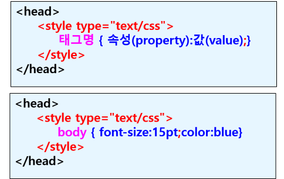
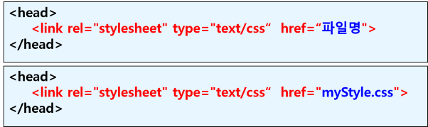
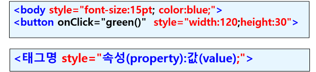

## 스타일 시트 적용 방법
### (1) 문서 내부에 정의 (Embedded Style)
- < style > 태그 사용
- < head > 태그 내에 삽입
- 문서 전체에 적용

 

 ## (2) 외부 문서에서 연결 (Linked Style)
 - 별도의 스타일 시트 파일로 작성하고 (.css)
 - HTML 문서에서 연결하여 사용
 - < head > 태그 내에 < link > 태그 사용

 

 ## (3) 태그에 직접 정의 (Inline Style)
 - 특정 태그에만 스타일 시트를 적용할 때 사용
 - <태그 style="width:100px">

 

## 다중 스타일 시트
- 하나의 요소에 대하여 외부, 내부, 인라인 스타일이 서로 다르게 지정되어 있는 경우 적용되는 스타일
- 스타일 적용 순서
    - (1) 웹 브라우저 디폴트 값
    - (2) 외부 스타일
    - (3) 내부 스타일
    - (4) 태그에 정의된 인라인 스타일 (최종 적용되는 스타일)