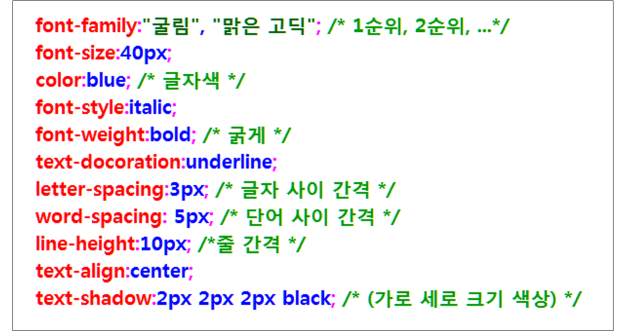
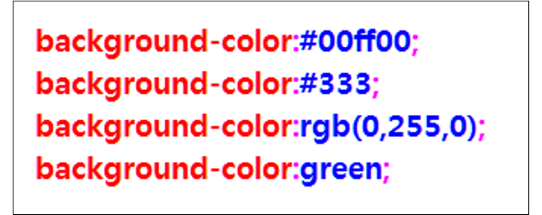
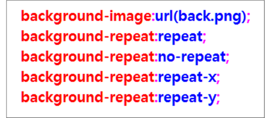
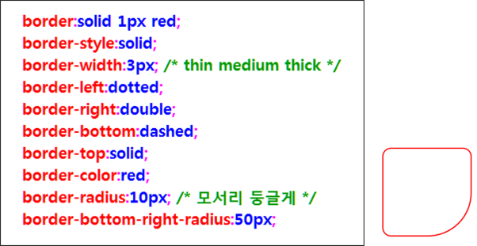
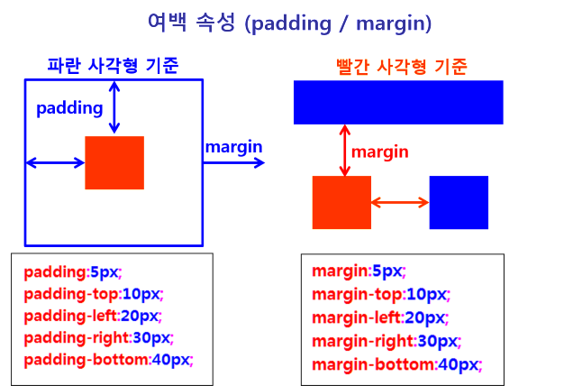
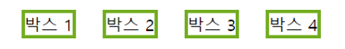
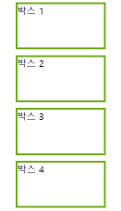
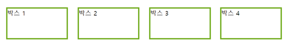
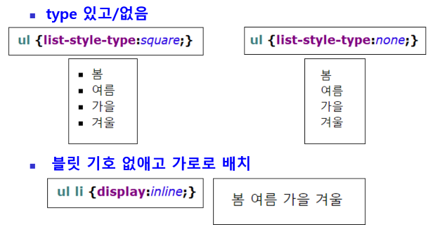

## CSS 속성
### 텍스트 속성
- 텍스트

### 배경 색상 / 이미지 관련 속성

- 배경색

- 배경 이미지

### 테두리 속성
- 테두리의 유형/굵기/색상

### 여백 속성 (Padding / Margin)
- padding : 영역 내부 여백 (들여쓰기 효과)
- margin : 외부 여백 (다른 요소와의 간격(띄어쓰기 효과))

### display 속성 : inline / block / inline-block
#### inline
- 옆으로 나란히 배치
- 여백 없이 내용물 만큼만 공간 차지
- width, height 설정해도 적용 안됨

#### block
- 행으로 배치
- 옆으로 나란히 배치 안됨
- 여백 있음

#### inline-block
- inline, block 특성 모두 포함
- 옆으로 배치, 여백 있음

### float 속성
-해당 요소를 떠 있게 만드는 속성
- 기본 레이아웃 흐름에서 벗어나 왼쪽이나 오른쪽으로 이동하는 것을 의미
- left : 왼쪽에 배치
- right : 오른쪽에 배치
- float : left;

### 목록 관련 속성
- < ul >, < ol > 태그 속성
- type 있고 / 없음
- display : 배치

### 위치 관련 속성
- static : 디폴트
    - 다른 요소와 겹치지 않게 배치
    - 위치를 지정하지 않으면 static 적용
- relative
    - static의 원래 위치를 기준을 계산
- absolute
    - 가장 가까운 상위 요소(부모 요소)를 기준으로 배치
    - 상위 요소가 static인 경우에는 브라우저 화면 기준
- fixed
    - 브라우저 화면을 기준으로 고정 위치에 배치

### 레이어 (겹침)
- z-index 속성
    - 요소들이 겹칠 때 순서 지정
    - 나중에 배치하는 것이 위에 놓임
    - z-index 값이 클수록 위에 놓임

### overflow 속성
- 자식 요소가 부모 요소의 범위를 벗어났을 때 어떻게 처리할 것인지 결정
- hidden
    - 부모 영역을 벗어나는 부분은 보이지 않게 처리
- scroll
     - 스크롤바 표시 (가로/세로)
- auto
    - 자동으로 필요한 부분에만 스크롤바 표시

### 투명도 / 가시성
- 투명도 (불투명도) : opacity 속성
    - 0~1 사이의 값 지정
    - 0 : 투명 (안보임)
    - 1 : 불투명 (보임)
    - 0.5 : 반투명
- 가시성 (보임/안보임) : visibility
    - hidden : 숨김 (안보임)
    - visible : 보임

### 그림자효과
- box-shadow 속성
- box-shadow:none | x y blur spread color
- x-position : 가로 위치에 그림자 표시. 양수(오른쪽), 음수(왼쪽) 필수
- y-position : 세로 위치에 그림자 표시. 양수(오른쪽), 음수(왼쪽) 필수
- blur : 흐리게 표현. 값이 클수록 흐림
- spread : 양수:그림자 확장, 음수:축소
- color : 색상