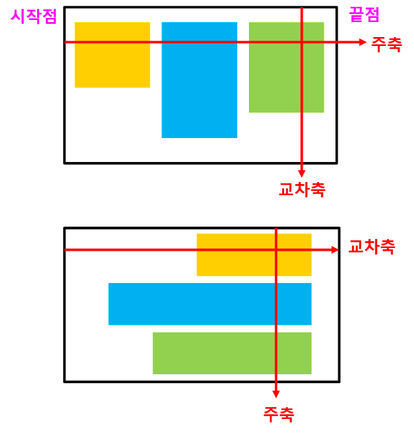

## 반응형 웹
- PC, TV, 스마트기기 등 다양한 기기의 화면이나 환경에 맞게 자유자재로 변하도록 만들어진 웹

### 반응형 웹 제작 기술
#### (1) 가변 그리드
- 고정 크기인 픽셀(px) 대신에 퍼센트(&)로 제작
- width:25%
- 한계
    - 그리드 기술을 사용하여 픽셀을 퍼센트로 바꾸어 비율로 제작하면 가변적으로 작동하기는 하지만, 기기나 환경에 따라 구조를 바꾸지는 못함
    - 화면을 제어할 '뷰포트'와 화면의 크기나 환경을 감지하여 구조를 바꿔줄 '미디어 쿼리' 필요

#### (2) 미디어 쿼리
- 화면의 크기나 환경을 감지하여 웹사이트를 변경하는 기술
- query - 질의(질문)
    - 미디어에게 질문하고 감지하여 변경하는 기술
    - 어떤 종류의 미디어인가, 미디어 화면의 크기는 어느정도인가 등


#### (3) 뷰포트
- 화면에 보이는 영역을 제어하는 기술
- 데스크탑 컴퓨터 : 해상도를 화면 크기로 감지
- 스마트 기기 : 기본 설정값을 보이는 영역으로 감지
- 뷰포트 기술로 스마트기기의 보이는 영역을 실제 화면 크기로 변경
- 미디어 쿼리가 기기의 화면 크기를 정확하게 감지할 수 있도록 하기위해 뷰포트 기술 이용
```html
<meta name="viewport" content="width=device-width, initial-scale=1.0">
```
- 뷰포트 영역 확인 방법 : 크롬 브라우저 개발자 도구에서 확인

#### (4) 플렉서블 박스
- 가변적인 박스를 만드는 기술인 동시에 우베사이트의 구조를 설계하기 위한 기술
- 가변적인 박스를 간단하게 만들어줄 뿐 아니라 박스를 쉽게 배치할 수 있다는 장점
- 플렉서블 박스의 특정 속성값을 설정하여, 여러 박스의 높이, 길이, 위치 등 유연하게 작동하는 박스를 간단히 만들 수 있음


---
#### 가변 폰트
- 글자를 가변적으로 변경해주는 폰트
- 뷰포트 비례 단위
    - vw, vh, vmin, vmax 단위
    - vw : 브라우저의 너비를 100으로 기준으로 해서 글자 크기 결정
    - vh : 높이를 100으로 기준
    - vmin : 너비, 높이 중 작은 쪽으로 기준
    - vmax : 너비, 높이 중 큰 쪽으로 기준

#### 미디어쿼리 문법
- @media [미디어 유형] and (조건문) {  실행문 }
- [미디어 유형] : 생략 가능
    - all, screen, tv, print,. …
    - 생략 시 all로 적용
    - 스마트 기기는 screen 사용
- (조건문)
    - 조건문이 참인 경우 뒤에 오는 것을 해석하라는 의미
    - (min-width:320px)
- { 실행문 }
    - 일반적으로 CSS 코드 작성


#### 미디어쿼리 사용 시 주의점
- and 다음에는 반드시 공백 있어야 함
- min 접두사 사용 시 반드시 크기가 작은 순서대로 작성
- max 접두사 사용 시 반드시 크기가 큰 순서대로 작성
- 순서가 중요한 이유
    - min은 최소 또는 그 이상이라는 뜻으로, 점차 커지는 것을 의미
    - max는 최대 또는 그 이하라는 뜻으로, 점차 작아지는 것을 의미
- 크기 감지 기준 : HTML 문서 크기
    - 미디어쿼리를 사용해서 브라우저의 크기를 감지할 때는 
    - HTML 문서 크기를 기준으로 감지

#### 외부 CSS 파일을 사용하는 경우
- < link > 태그 내 media 속성 사용
```html
<link ..  media=”(max-width:600px)”>
```

#### 플렉서블 박스 (Flexbox)
- 구성
    - 플렉서블 박스 (부모 (상위 요소))
    - 플렉스 아이템 (하위 요소)




#### 플렉서블 적용 방법
- 부모 박스 (플렉서블 박스) 배치 
    - flex : 수직 배치 (block 형태)
    - inline-flex : 수평 배치 (inline-block 형태)
- 플렉스 아이템 
    - 배치 (방향)
    - 가로로 배치 : flex-direction:row;
    - 세로로 배치 : flex-direction:column;
- 정렬
    중앙
    간격
    양 옆 공간