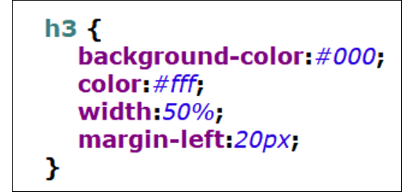
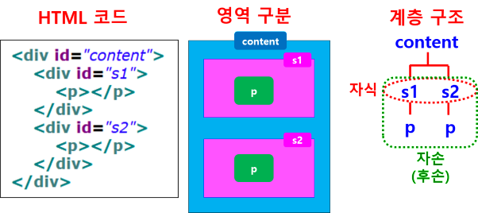

## 스타일 시트의 기본 형식
- 선택자 (selector)
    - 스타일을 적용할 대상
    - HTML 문서의 태그, 아이디, 클래스, 속성 선택자
- {속성:값;}
    - 속성 : 변경하고자 하는 속성
    - 폰트, 크기, 색상 등

## 선택자 유형
### (1) 태그 선택자
- 태그명 사용
- 태그(요소 : element) : 요소 선택자라고도 함
- HTML 문서 내의 같은 모든 태그에 동일하게 적용
- 태그명 {속성 : 값;}



### (2) 클래스 선택자
- 문서에서 특정 부분에만 css 적용할 때 사용
- 사용자 정의 선택자로 사용자가 정의한 클래스 선택자를 태그에 적용
- 여러 개의 요소(태그)에 적용 (그룹 효과)
- .(dot) 사용
- 태그의 class 속성 사용
- 형식 : 클래스명 {속성 : 값;}
- 사용 예
    - .className { 속성:값; }
    - <태그명 class=”className”>박스1</태그명>
    - ```html
        .box { background-color:red; }
        <div class=”box”>박스1</div>
        <div class=”box”>박스2</div>
        <div class=”box”>박스3</div>
    ```

### (3) 아이디 선택자
- id로 지정된 특정 태그에 css 적용할 때 사용
- 태그에 유일한 아이디를 지정하고 css 적용
- '#' 사용
- 사용 예
    - <태그명 id="아이디명">박스1</태그명>
    - #아이디명 {속성:값;}
    - ```html
        <div id='box1'>박스1</div>
        #box1 {width:100px;}
    ```

### (4) 속성 선택자
- 태그의 속성 값에 따라 선택자로 정의
- CSS 문법
    - 태그명[속성]
    - 태그명[속성="값"] : 완전 일치
    - 태그명[속성^="값"] : 시작
    - 태그명[속성$="값"] : 끝
    - 태그명[속성*="값"] : 포함

### (5) 상태 선택자
- 태그의 상태에 따라 선택
- 체크 상태, 포커스를 받은 상태, 사용 가능한 상태, 사용 불가능한 상태
- 선택자 : checked, focus, enabled, disabled

### (6) 상속 선택자



- 자식 선택자 : > 부호 사용
    - 선택자 > 자식선택자
    - #header > h1
- 자손(후손) 선택자 : 공백 (띄어쓰기)
    - 선택자 자손서낵자
    - #header h1
- first-child 선택자
    - 자식 요소 중 첫 번째 요소 선택
    - .wrap div:first-chile : 첫 번째 자식
    - .wrap div:first-child + div : 두번째 div 요소
- nth-child(숫자)
    - .wrap div:nth-chile(2) : 두번째 자식

### (7) 동적(반응) 선택자
- 선택자 : active - 마우스로 클릭한 태그 선택
- 선택자 : hover - 마우스를 올린 태그 선택