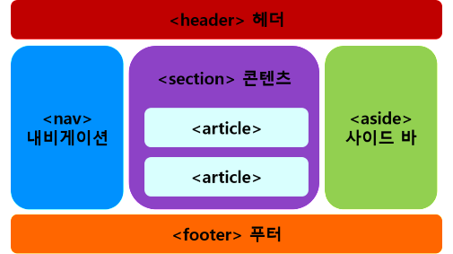
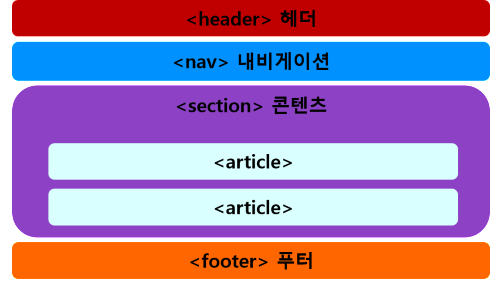
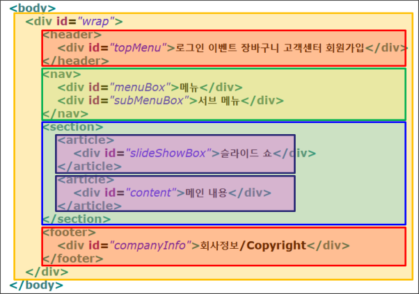

### HTML5 시멘틱 구조 태그
- 시멘틱(Semantic) : 의미의, 의미론적인
- 역할과 기능에 맞는 요소로 영역 구분
- 각 요소가 의미가 있다는 것
#### 요소
- < header > : 헤더 (제목)
- < nav > : 내비게이션 (메뉴)
- < aside > : 사이드 바
- < section > : 콘텐츠 (내용)
- < article > : 콘텐츠 안의 내용
- < footer > : 푸터 (주소/연락처/저작권 등)

html5_structure1

### HTML5 시멘틱 구조의 특징
- HTML4로 만든 웹 문서의 결과 화면이나 HTML5로 만든 웹 문서의 결과 화면만 보면 웹 브라우저에 보이는 모습은 동일하지만 실제로 웹 브라우저에서 문서를 처리할 때 큰 차이

### HTML5 시멘틱 구조의 장점
- 소스만으로도 문서 내용 쉽게 이해
    - 태그만 보고도 어느 부분이 제목이고, 메뉴이고, 실제 내용인지 쉽게 구분
- 편리한 검색
    - 1. 사이트 검색 시 필요한 내용을 정확하게 찾을 수 있어 편리
    - 2. < header >나 < nav > 태그 부분은 검색하지 않고, < section > 이나 < article > 태그 부분만 찾아 검색
- 뛰어난 웹 접근성
    - 시각 장애인들이 웹 보조 기구로 사용하는 화면 판독기에서 시멘틱 태그를 통해 제목과 내용을 구별하여 사용자에게 정확한 내용 전달 가능
- 다양한 장치에 통일된 결과 제공

