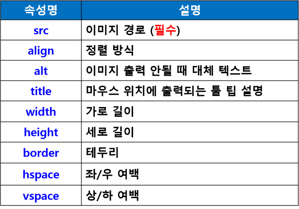

# 태그 (tag)
- HTML에서 사용하는 명령어 (문자열 기호)
- 원하는 모양과 형태로 브라우저에게 명령을 내림


## 태그 사용 형식
- 대부분 시작 태그 (<>)와 종료 태그(</>)를 함께 사용
    - <태그명>출력내용</태그명>
- 태그 내 속성
    - <태그명 속성명='속성값>출력내용</태그명>
- 예외로 종료 태그 없이 혼자 사용하는 태그
    - < br > 또는 < br/ > : 줄 바꿈
    - < img > : 이미지 삽입
    - < hr > : 수평선 삽입
- 대소문자 구분 없이 사용

## HTML 문서 구조


- HEAD 부분
    - 문서의 정보를 작성하는 부분
    - 제목
    - 문자 세트 : 문자열 처리 방식
    - 외부 연결
    - CSS 정의
    - 자바스크립트 정의
    - ...

- BODY 부분
    출력 내용

- 기본 태그
    - HTML 문서 구조 태그
    - 텍스트 관련 태그
    - 하이퍼링크 태그
    - 목록 태그
    - 테이블 태그
    - 이미지/이미지맵 태그
    - 오디오/비디오 태그
    - 입력 양식 태그
    - 공간 분할 태그 (HTML5 시멘틱 구조 태그)

### (1) 텍스트 관련 태그
#### < hn > 태그
- 제목에 사용
- Headline의 약어
- 줄바꿈하여 출력
- 크기는 1 ~ 6 : 1이 제일 크고, 6이 제일 작음

#### < br > 태그
- 줄바꿈 태그
- 여러 줄을 바꾸려면 여러 개 사용

#### < p > 태그
- 문단을 나누는 태그 (paragraph)
- < br > 태그를 2번 사용한 만큼의 간격
- < p >태그를 여러 번 연속적으로 사용해도 행 간격은 더 벌어지지 않음

#### 주석 처리
- < !-- 주석 내용-- >
- 자동 입력 : Ctrl + /

#### < pre > 태그
- 입력한 형태 그대로 출력
- 줄바꿈, 공백 그대로 출력

### 하이퍼링크 태그
- < a > 앵커태그
- 원하는 문서나 사이트로 연결
- 새 창 또는 새 탭에서 링크 열기
- 한 페이지 내에서 지정된 영역으로 이동


- 예
```html
<a href = '이동 링크'>
```

### 목록 태그
- 기본 목록 태그


- 순서가 없는 목록 <ul> 태그 속성


- 순서가 있는 목록 <ol> 태그 속성


- 목록 태그 중첩 사용


### 테이블 태그
- 테이블 관련 태그


- < table > 태그 속성


- < tr > 태그 속성


- < td > 태그 속성


#### < thead >, < tbody >, < tfoot >
- 표의 제목과 본문 등 구분
- 셀을 그룹지어 놓으면 화면 판독기 등에서 테이블 구조를 쉽게 이해
- CSS를 사용하여 테이블의 각 부분에 다른 스타일 적용할 수 있어 편리

### 이미지/이미지맵 태그
- < img > 태그
    - 이미지 출력
- < img > 태그 속성



#### 이미지 파일 경로
- (1) 이미지가 html파일과 같은 폴더에 있는 경우
- 이미지파일명만 입력
- < img src = '이미지파일명' >

- (2) 이미지가 하위폴더에 있는 경우
- 폴더명/이미지파일명
- < img src = '/폴더명/이미지파일명' >

- (3) 이미지가 상위폴더에 있는 경우
- ../폴더명/이미지파일명
- < img src = '../폴더명/이미지파일명 >

#### < img >태그의 usemap 속성
- 이미지 맵
    - 하나의 이미지에 여러 개의 링크를 만들어 놓고 각 영역마다 다른 링크 연결
- 사용 방법
    - < map > 태그를 이용해서 이미지 맵을 만들고
    - < img > 태그의 usemap 속성으로 이미지 맵 지정
- 이미지 좌표값 필요
    - 좌측 상단의 x, y 좌표
    - 우측 하단의 x, y 좌표
    - 그림판에서 쉽게 확인 가능
- 예
```html

<map name='cityMap'>
    <area shape="rect" coords="60,90,250,150" href="NewYork.html">
    <area shape="rect" coords="310,90,500,150" href="Paris.html">
    <area shape="rect" coords="560,90,750,150" href="Japan.html">
    <area shape="rect" coords="810,90,1000,150" href="Vitenam.html">
</map>
```
### 오디오/비디오 태그
- < audio > 태그
    - 오디오 파일 재생

- < audio > 태그 속성
    - src : 파일 경로
    - preload : 재생하기 전에 오디오 파일을 모두 다운로드
    - autoplay : 자동재생
    - loop : 반복 재생
    - controls : 재생 도구 출력

- < video > 태그
    - 비디오 파일 재생
    - mp4, ogv ..

- < track > 태그
    - 자막 표시
    - WebVTT 형식 파일 (.vtt)
    - Web Video Text Tracks

- < video > 태그 속성


### 입력 양식 태그
- 입력 양식(폼)을 만들 때 사용하는 태그
- < form > 태그
    - 입력 양식을 구성하는 기본 골격 제공
- < form > 태그 속성


- < label > 태그
    - 폼 요소에 캡션 붙이는 태그

- < input > 태그
    - 데이터를 입력 받기 위한 태그
- < input > 태그 속성


- < input > 태그의 type 속성


- 라디오 버튼
    - 여러 항목 중에 한 개를 선택할 때 사용
    - < input type='radio' >


- 체크박스
    - 여러 항목 중에서 여러 개를 선택할 때 사용
    -< input type='checkbox' >


- checkbox와 radio 버튼의 경우 < label > 태그를 사용하면 텍스트 범위까지 클릭 영역에 포함됨

- < select > 태그
    - 드롭다운 목록 표시
    - < option > 태그 : 각 항목에 해당


- < textarea > 태그
    - 여러 라인 입력


### 공간 분할 태그 
- < div > 태그
    - bolck 형식으로 공간 분할

- < span > 태그
    - inline 형식으로 공간 분할


- < div > 태그 중첩 사용

