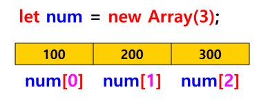
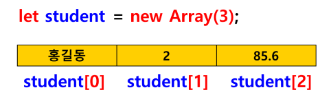

## 배열
- 동일한 이름을 갖는 원소들의 연속적 저장 영역 (여러 개의 값을 저장)
- 배열의 우너소는 메모리 내에서 순서대로 저장
- 각 배열의 원소는 인덱스로 구별 (인덱스는 0부터 시작)



- 배열에 값을 저장하고, 배열에 들어 있는 값을 출력하는 방법을 학습
- 배열의 크기를 나타내는 속성 : length
    - num.length
    - for(let i=0;i;num.length;i++){}

### 자바스크립트 배열의 특징
- 자바스크립트 배열은 각 원소에 다른 유형의 데이터 저장 가능



### 배열 선언 형식
#### (1) 변수 = new Array();  // 크기가 정해지지 않은 배열 선언
```html
let num = new Array();
```

#### (2) 변수 = new Array(크기); // 크기 지정
```html
let num = new Array(5); 
```

#### (3) 변수 = new Array(값1, 값2, 값3, …); // 초기화
- 배열 생성과 동시에 초기화 (값 저장)
```html
let fruits = new Array(“사과”, “배”, “포도”);
```

### 배열의 초기화 방법
- 배열 선언과 동시에 원소 값 저장
#### (1) 변수 = [값1, 값2, 값3];
```html
let num = [100, 200, 300];
```

#### (2) 변수 = new Array(값1, 값2, 값3)
```html
let fruits = new Array("사과", "포도", "복숭아")
```

### 배열 사용
- 배열 원소에 값 저장
    - 1개의 원소에 값 저장
        - a[2] = 10; // 3번째 원소에 10 저장
    - 배열 전체에 한꺼번에 값을 저장 : for 문 사용
    - for(let i=0; i<num.length; i++)
        num[i] = 값;  // i번째 원소에 값 저장
- 배열 원소에 들어 있는 값을 출력
    - 1개의 원소의 값 출력
        - document.write(a[0]);
    - 배열 전체의 원소의 값을 한꺼번에 출력 : for문 사용
    - for(let i=0; i<num.length; i++)
        document.write(num[i] + “ “);
- 주의!!!!
    - 배열의 전체 원소에 값을 저장하거나 출력하기 위해서는 반복문 사용
    - 배열은 크기가 정해져 있기 때문에 반복 횟수를 정할 수 있으므로 for 문 사용
    - 반복문 시작은 반드시 0부터 (인덱스가 [0] 부터 시작)

### 배열에 사용하는 for 문
#### for in 문
- 배열이나 객체를 쉽게 탐색하기 위한 for 문
- 배열의 각 원소를 하나씩 변수에 저장해서 사용
- 이 때 변수에 저장되는 인덱스 
```html
for(변수(인덱스) in 배열) {
		수행되는 문장 
		변수값(인덱스) 출력
		배열[인덱스] 사용
}
```

#### forEach() 메소드(함수)
- 배열.forEach(함수) : 객체.메소드()
- 배열.forEach(function(매개변수){ ... })
```html
forEach(function(item, index, arr){})
```
- 첫 번째 매개변수 : 배열의 항목
- 두 번째 매개변수 : 배열의 index
- 세 번째 매개변수 배열 그 자체
- 매개변수명은 임의로 사용해도 됨
- 전달되는 매개변수 순서는 정해져 있음