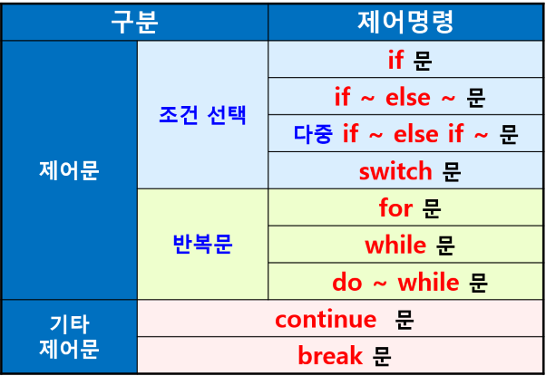
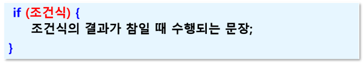
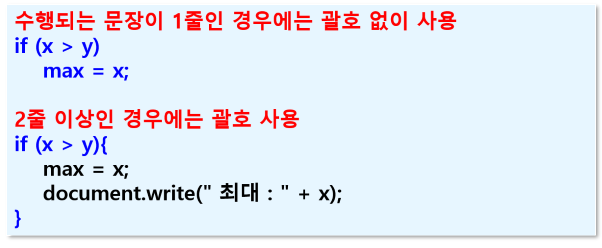
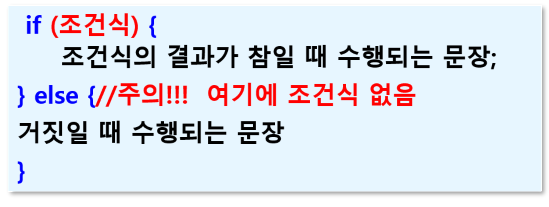
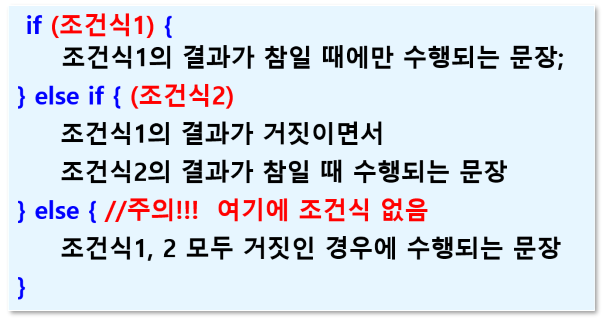
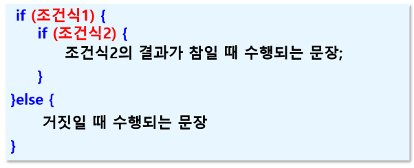
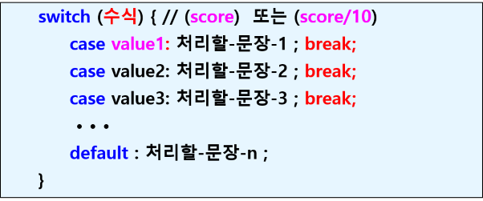
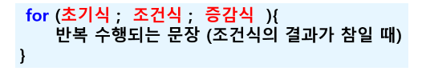
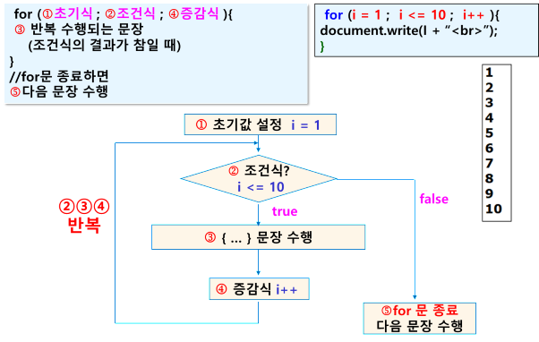
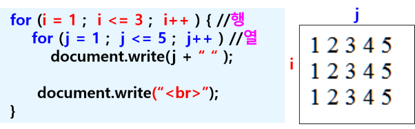

## 제어문
- 프로그램의 흐름을 제어
- 조건문 (선택)
    - 조건에 따라 문장을 수행하거나 수행하지 않음
- 반복문
    - 조건에 따라 특정 문장을 반복 수행

### if 문

### if else 문

### 다중 if else 문

### 중첩 if 문

## switch 문
- 형식

### 주의!
- (수식)으로는 값의 결과가 정수, 실수, 문자열, 객체 값이 올 수 있음
- case 뒤의 value로는 반드시 하나의 값만 사용
- case 다음에는 콜론(:) 사용 (세미콜론 아님)
- break 문이 없는 경우 해당 case에서 실행이 멈추지 않고 다음 case까지 수행됨

## 반복문
- 조건에 따라 특정 문장을 반복 수행

### for 문
- 형식

### 중첩 for 문
- for문에 fro문 포함
- 2차원 테이블 형태로 표현할 때 사용

### while 문
- 조건에 따라 특정 부분을 반복 수행
- 조건식을 먼저 확인한 후 조건이 참이면 문장 반복 수행
- 형식
    - 초기값 설정
    - while(조건식){
        반복 수행되는 문장
        증감식;
    }
- 주의
    - 초기값과 증감식을 반드시 적어줘야 한다
    - 증감식이 없으면 반복문을 종료하지 못하고 무한반복 수행

### do ~ while 문
- 먼저 반복 수행되는 문장을 1번 수행한 후 조건식이 참이면 반복 수행
- 최소 1번은 수행됨
- 형식
    - do {
        반복 수행되는 문장
    }while(조건식);

### break 문
- 반복문 한 개를 빠져 나갈 때 사용
- for, while, do~while 문 종료 (반복 취소)
- switch 문 종료 시 사용
- 일반적으로 if문과 같이 사용
    - if문 조선식에 따라 반복문 종료
- 주의
    - 반복문이 중첩되어 있는 경우, 자신이 속한 가장 가까운 하나의 반복문만 벗어남
    - 바깥쪽 반복문까지 종료시키려면 바깥쪽 반복문에 이름을 붙이고 break 이름;

### continue 문
- continue 문을 만나면 수행 중인 문장은 중단하고, 다음 반복 계속 수행
