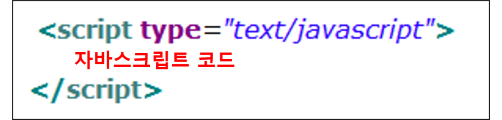
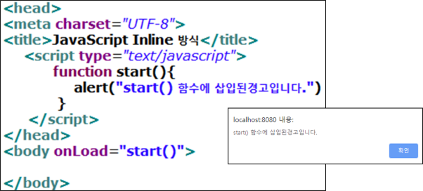

## 자바스크립트 기본 구조
- HTML 문서 < script > 태그 삽입

## 자바스크립트 사용법 3가지

### (1) Internal 방식
- HTML 문서에 삽입
- 일반적으로 < head > 부분에 삽입하지만 < body > 안의 임의 부분에 삽입해도 됨
- 실행 순서는 < head > 먼저 실행

### (2) External 방식
- 별도의 자바스크립트 파일 (.js)로 작성하고
HTML 문서에서 < script > 태그의 src 속성으로 지정
< script src=”a.js” >

### Inline 방식
- 자바스크립트 양이 적을 때 HTML 태그의 이벤트 핸들러 속성을 이용하여 
함수 호출

- < body onLoad="자바스크립트 함수 호출" >
- < button onClick="showName()" >