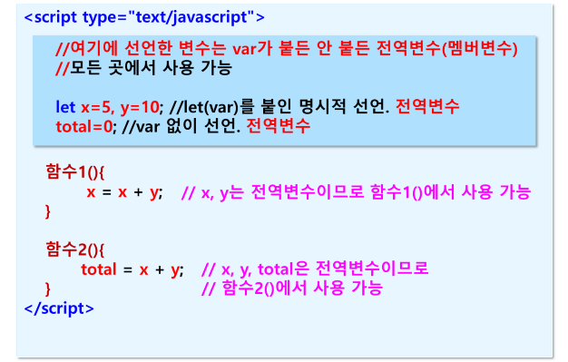
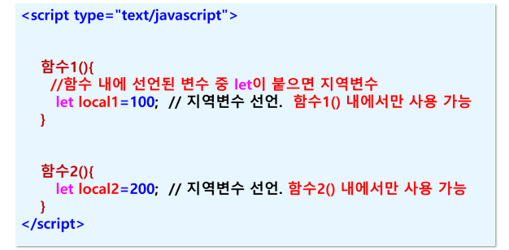
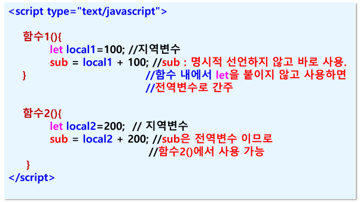

## 변수 (variable)
- 프로그램 실행 중에 값을 저장하기 위한 메모리 내의 임시 기억장소
- 식별자 
- 변수의 값은 변경 가능 

### 자바스크립트에서 식별자(변수명, 함수명 등) 명명 규칙
- 사용자가 임의로 작성 
- 시작은 반드시 영문자 또는 _ 사용 (숫자로 시작할 수 없음)
- 대소문자 구별
- 키워드(예약어) 사용할 수 없음
    - 자바스크립에서 미리 맡아놓은 단어들 
    - 예 : if, else, let, var, const 
- 특수문자나 공백은 사용할 수 없음
- 한글 사용 가능 (영문 사용 권장)
- 의미 있는 단어 사용 
    - 예 : name, address, age

### 변수 선언 
- 변수를 반드시 선언하지 않아도 됨
- 변수를 필요한 곳에서 사용하면 자동으로 생성됨
- 변수의 데이터 타입은 실행 시 결정 (동적 타이핑)
    - C 또는 Java 언어의 경우 선언시 데이터 타입을 미리 지정
    - int x  = 10; // 정수를 저장하기 위한 변수 x 
    - 자바스크립트는 값 실행할 때 데이터 타입이 결정되기 때문에 미리 데이터 타입 명시하지 않음
        - let x = 10;
- 명시적으로 선언
    - let / var / const를 사용해서 사용하기 전에 미리 명시적으로 선언
    - let x  = 100;
    - var name = “홍길동”;
    - const rate = 0.05;

#### 전역변수
- 전역변수 범위 (< script > 태그 아래)에 명시적으로 선언되거나
명시적으로 선언하지 않고 사용하는 변수
- let/var가 붙든 안 붙든 전역 변수
- 자바스크립트 코드 내 모든 곳에서 사용 가능

#### 지역변수
- 함수(블록) 내에서 var/let를 붙여서 선언된 변수
- 함수(블록) 내에서만 사용 가능

##### 전역변수

##### 지역변수

##### <함수 내에서 만들어진 전역변수>
- 함수 내에서 let/var 안 붙인 변수

### var와 let 차이점
- scope (범위)
    - var는 function 단위의 scope
    - let은 { } block 단위의 scope
- 동일 변수명으로 재선언
    - var는 오류 없음
    - let은 오류 있음
- 호이스팅
    - 선언 전에 미리 사용하는 것
    - var : undefined 출력
        - document.write(name);
        - var name = “홍길동”;
    - let : 오류
        - document.write(name);
        - let name = “홍길동”;

