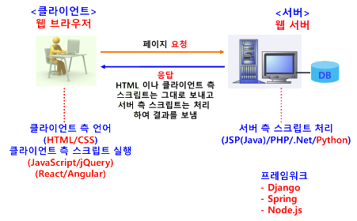

### 웹(Web) 개념
- 웹 서비스
    - 인터넷을 기반으로 제공되는 서비스

- 웹 애플리케이션
    - 웹을 기반으로 작동되는 프로그램으로 웹 프로그래밍을 통해 구현

### 웹 동작 구조

### 프론트엔드 / 백엔드 개발

#### Front-End
- 웹 사이트 중 사용자와 직접 상호작용 하는 부분
- 사용자 인터페이스(UI)와 사용자 경혐(UX)을 만드는데 초점을 맞춤
- 슬라이더, 드롭다운 메뉴, 레이아웃, 폰트, 컬러 등등
- 언어 : HTML, CSS 및 JavaScript
- 자바스크립트 라이브러리 : jQuery, ReactJS 등
- 프레임워크 Bootstrap, Angular 등

#### Back-end
- 서버 측 개발 분야
- 프론트엔드에 있는 사용자의 요구 처리
- 서버, 응용 프로그램 및 데이터베이스로 구성
- 시스템 컴포넌트 작업, API작성, 라이브러리 생성, 데이터베이스 통합 등 다양한 작업 처리
- 언어 : Java(JSP), PHP, Python, .Net 등
- 자바스크립트 라이브러리 : Ajax
- 프레임워크
    - 자바 - 스프링
    - 파이썬 - Django
    - Node.js - Express

#### Full stack
- 프론트엔드와 백엔드 전체 개발 작엄

## HTML (Hyper Text Markup Language)
- 웹 브라우저에서 하이퍼텍스트 기능을 구현하는 웹 페이지 작성 언어
- 하이퍼 텍스트
    - 문서 간에 링크가 설정되어, 설정 부분을 클릭하면 해당 문서로 이동하는 기능

## CSS (Cascading Style Sheets)
- 계단형 스타일 시트
    - 단계적으로 스타일 적용
    - 여러 스타일이 겹치면 맨 마지막 스타일 적용
- HTML 레이아웃 배치 등의 한계를 보완하기 위해 개발된 독립 언어
- 일정 기능들을 미리 지정하여 여러 부분에서 동일하게 적용

#### 기능
- HTML 문서 내의 폰트 종류, 크기, 색상, 배경, 테두리, 레이아웃 배치, 여백 등 지정
- 정렬, 그림자 등 다양한 효과

#### 장점
- 자유롭게 웹 문서 편집
- 통일감 있는 문서 작성
- 편리한 문서 관리
    - 외부 스타일 시트 파일 사용하는 경우, 여러 웹 문서에 동일한 스타일 시트 적용 가능하고 한번 수정으로 모든 웹 문서의 스타일을 동시에 변경 가능
    
## JavaScript
- 정식 명칭 : ECMAScript (ES)
- 동적인 웹페이지를 작성하기 위하여 사용되는 언어
- 웹의 표준 프로그래밍 언어, 모든 웹브라우저에서 자바스크립트 지원
- 웹브라우저 뿐 아니라 스마트기기 애플리케이션 개발 등 각종 분야에서 사용

#### 기능
- HTML이 지원하지 못하는 다양한 기능 지원
    - 동적인 움직임
    - 이벤트 발생 처리
    - 경고(알림) 메시지 출력
- Ajax를 잉ㅇ하여 새로운 내용을 동적으로 로딩하거나 서버에 전송하여 동적인 페이지 생성 (데이터 출력)
- 애니메이션 기능 추가 (페이드인, 페이드아웃, 크기변경, 위치이동 등)
- 오디오/동셩상 재생하는 인터랙티브 컨텐츠 제어
- 웹 페이지 폼의 입력 값을 서버에 보내기 전에 내용 검증 (유효성 검사)
- 브라우저 사용자의 특성에 대한 정보를 서버로 전송하여 웹 분석, 사용자 동작 트래킹, 웹 서비스 개인화 등에 사용