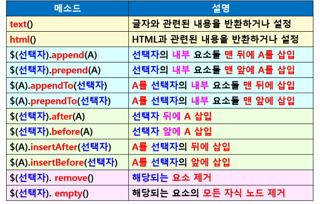

## jQuery DOM 요소 조작
- 동적으로 DOM 요소 조작
- DOM 요소 삽입
- DOM 요소 삭제
- DOM 요소의 속성 추가 및 삭제
- DOM 요소의 클래스 속성 설정

### text()와 html() 메소드
- 자바스크립트의 innerHTML 속성과 유사
- DOM 요소의 텍스트/HTML을 설정하거나 반환
- html() 
    - HTML 태그 인식 (태그 효과 적용)
- text()
    - HTML 태그 인식하지 못하고 글자로 인식

### DOM 요소의 속성 추가 및 삭제
- attr(‘속성명’, ‘속성값’) 사용

### jQuery 효과
- Basic 효과
    - hide() / show() / toggle()
- Sliding 효과
    - slideDown() / slideUp() / slideToggle()
- Fading 효과
    - fadeIn() / fadeOut() / fadeToggle() / fadeTo()
- Animate 효과
    - animate(속성)
- 공통 인수
    - duration : 효과 진행 속도 (slow/normal/fast)
        - 시간 설정 : 3000(3초)
    - callback : 효과 완료 후 수행할 함수
    - easing
        - 전체 애니메이션의 적용시간 비율을 원하는 진행 비율로 매핑
        - swing : 느리게 시작해서 빠르게 진행되다가 나중에 다시 느려지는 효과
        - linear : 선형 (일정 속도)