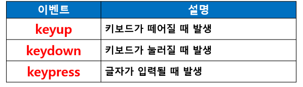
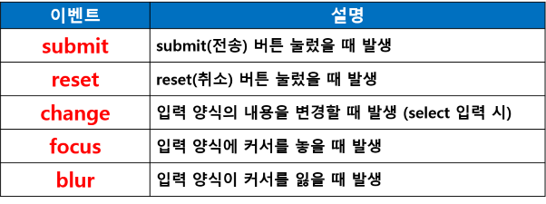

## jQuery 이벤트
- 기존의 자바스크립트에서 사용했던 이벤트 대부분 사용
- jQuery를 이용하여 이벤트를 처리하면 훨씬 간단하고 쉽게 이벤트 처리 가능
- 이벤트 적용 방법
- 이벤트 유형
    - 윈도우 이벤트
    - 입력양식 이벤트
    - 마우스 이벤트
    - 키보드 이벤트

### 이벤트 사용 기본 구조
- (1) 이벤트 대상 : $(‘#btn’)
- (2) 이벤트 등록 메소드 (이벤트 유형) : click()
- (3) 이벤트 핸들러 (이벤트 처리 함수) : function() { … }

### 이벤트 등록 메소드 유형
- 단독 이벤트 등록 메소드
    - $(‘#btn’).click(function() {
		});
    - 주의! : 동적 연결 지원 안 됨
        - 동적으로 요소를 생성한 경우
        - 동적 요소에 이벤트 연결 불가
- 그룹 이벤트 등록 메소드 (여러 이벤트 적용)
- $(‘#btn’).on(‘mouseover focus’, function() {
	});
    - 동적으로 생성된 요소에 적용 가능

### 이벤트 연결 방식
- 정적 연결
    - 현재 HTML 화면에 있는 태그에만 이벤트 연결
    - jQuery를 통해 새로 삽입되는 태그에는 이벤트 연결 안 됨
- 동적 연결
    - 현재 HTML 화면에 표시된 요소와 앞으로 생성될 요소에 전부 이벤트 연결 가능

#### 동적 연결 이벤트
- 동적으로 생성된 요소에 이벤트 연결 
- 동적으로 추가 : after(추가할 요소)
    - $(this).after(“< input type=’button’ id=’newBtn’ value=’새버튼’ >”);
- 동적 연결 이벤트 : document에 적용
    - $(document).on(‘click’, ‘#newBtn’, function() {
             });

### 입력 양식 관련 이벤트
#### 키보드 이벤트

#### 입력 양식 이벤트

#### < input > 입력란에서 엔터키 쳤을 때 문제
- < input > 입력란에서 엔터키를 치면 무조건 submit() 호출되면서 서버로 전송되는 문제 발생
- id 입력란에서 엔터키를 치면 무조건 submit 이벤트가 발생하면서 아이디 확인
- ([완료] 버튼 누른 것과 동일)
- submit 되지 않도록 문서 전체에서 이벤트 처리
- 엔터키 코드값 : 13
    - return false

#### 이벤트 객체의 중단 메소드
- preventDefault()
    - 현재 이벤트의 기본 동작 중지
- stopPropagation()
    - 상위 요소로 이벤트가 전파되는 것을 중지
- stopImmediatePropagation()
    - 현재 이벤트의 다른 리스너 중지 및 상위로 전파되는 것 중지

#### HTML 요소의 기본 동작
- < a > 태그 클릭 시
    - href 속성에 지정된 url로 이동
- document에서 오른쪽 마우스 클릭 시
    - contextmenu (팝업메뉴) 출력

#### 이벤트 발생 시 기본 동작을 중단하는 메소드
    - preventDefault()