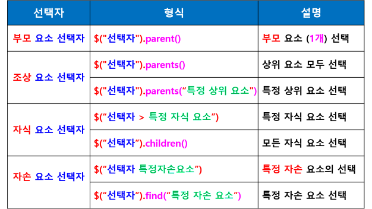
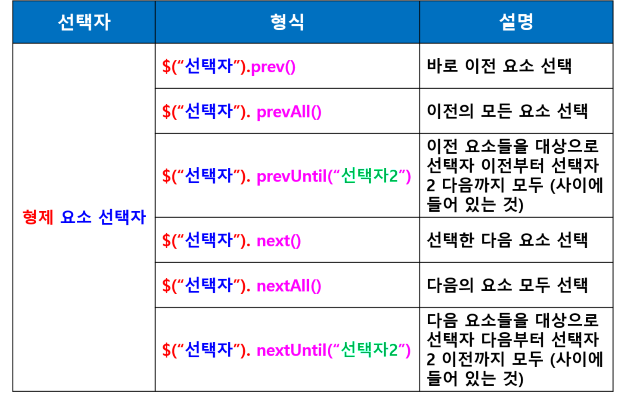
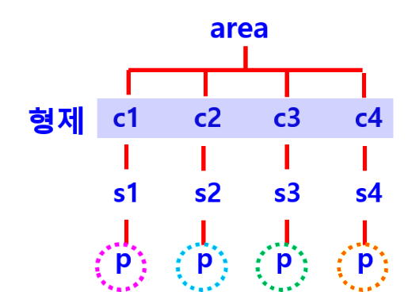
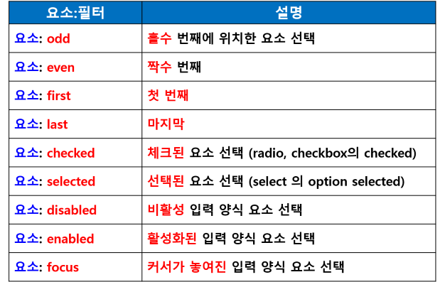

##  jQuery 선택자
- CSS에서 사용했던 선택자 그대로 사용
- $(‘선택자’).메소드(매개변수, 함수 등);
- $(‘div’).hide();
- 큰 따옴표 / 작은 따옴표 다 사용 가능

### 선택자 
- 직접 선택자
    - 전체(*), 태그, 아이디, 클래스 
- 인접 관계 선택자
    - 상위 요소 (조상/부모) 
    - 하위 요소 (자식/자손)
- 속성 선택자
- 필터 선택자

#### 직접 선택자
- $(“*”)
- $(“태그명”)
- $(“#id명”)
- $(“.클래스명”)

#### 하위 요소 (자식/자손)
- $(“ol li”) : 자손 선택자
- $(“div  > h3”) : 자식 선택자
    - $(“div”).children() : 자식 선택자
- $(“#menu  > h3”) : 자식 선택자

#### 인접 관계 선택자

##### 자식 요소 선택
- '>', 공백
- find() / children()

##### 조상/부모/형제 요소 선택자
- parents() / parent()
- next() / nextAll() / nextUntil()
- prevAll() / prevUntil()

#### 필터 선택자

