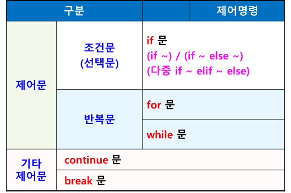

# 제어문
- 프로그램의 흐름을 제어하는 구문
- 일반적인 코드 실행 흐름
    - 위 -> 아래 방향으로 한 줄씩 실행
- 제어문
    - 코드 실행 흐름을 개발자가 원하는 방향으로 변경할 수 있도록 해 줌
    - 조건에 맞지 않으면 수행하지 않고 건너 뜀
    - 특정 문장을 반복 수행



## if 문
- 조건식이 참이면 주어진 문장 수행
- 조건식이 거짓이면 아무것도 수행하지 않음
- if 문 형식
    - 조건식 다음에 콜론(:) 사용
    - 수행문장 앞에 들여쓰기 (탭 또는 스페이스 4칸)

```python
if 조건식 :
    수행문장
```
## if ~ else 문
- 조건식이 참이면 if 문 수행
- 조건식이 거짓이면 else 문 수행
- 형식
    - 조건식과 else 다음에 콜론(:) 사용
    - 수행문장 앞에 들여쓰기 (탭 또는 스페이스 4칸)
```python
if 조건식 :
    수행문장
else :
    수행문장
```
## if ~ elif ~ else 문
- 조건식이 여러 개인 경우
```python
if 조건식1 :
    조건식1이 참인 경우 수행되는 문장
elif 조건식2 : 
	조건식2가 참일 경우 수행되는 문장
else : 
	모든 조건식이 거짓인 경우 수행되는 문장
```
## for 문
- 정해진 횟수만큼 반복
- 콜론(:), 들여쓰기 
- 형식
```python
for 변수 in 리스트 또는 범위(집합 값):
	반복 수행되는 문장
```


### range() 함수
- 특정 범위의 정수 생성
- range(10) : 0 ~ 9까지의 정수 (10개 / 시작은 0)
- range(start, end)
    - start에서 end-1까지의 정수
    - range(0, 10) : 0 ~ 9까지의 정수
- range(start, end, step)
    - start에서 end-1까지 step 간격으로 정수 생성
    - range(1, 11, 2)
        - 1 ~ 10까지 2씩 건너뛰면서 정수 생성
        - 홀수 생성

## while 문
- 조건에 따라 반복 수행
- 조건식을 먼저 확인한 후 - 참이면 문장 반복 수행
- 주의
    - 초기값 / 증감식 필수
    - 초기값이 없으면 조건이 맞는지 알 수 없고 증감이 없으면 반복문을 종료할 수 없음
```python
초기값
while 조건식 :
	반복 수행되는 문장
	증감식
```

### 무한 반복
- 조건이 무조건 참인 경우 계속 반복
- 반복문을 종료하기 위해 break 문 사용
```python
while True:
    반복수행되는 문장
    조건 
        break
```

### continue 문
- 반복문 수행 중에 continue 문을 만나면 현재 시점에서 중단하고 (다음에 있는 문장은 수행하지 않고) for 문의 다음 반복 계속 수행