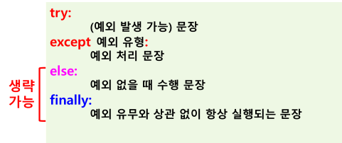

# 예왜 처리
## 에러 (Error) : 오류
- 문법적 오류나 실행 시간에 잘못된 메모리 접근 오류, 논리 오류, 사용자의 잘못된 입력 오류 등
- 오류가 발생하면 프로그램 중단되고 에러 메시지 출력
- 발생되는 에러 예 :
    - ZeroDivisionError : 0으로 나누었을 경우 
    - FileNotFoundError : File을 못 찾았을 경우
    - IndexError : 리스트 등에서 인덱스 잘못되었을 때

## 예외 (Exception)
- 에러(오류)에 대처하기 위한 오류
- 예외는 주로 실행 중에 발생

## 예외 처리(Exception Handling)
- 오류 발생 시 프로그램이 중단되고 에러 메시지가 출력되지 않도록 예외를 발생
- 예외 처리(Exception Handling)를 통해 정상 실행 되도록 하기 위한 방법
- 예: 
    - except ZeroDivisionError as e:
    - 에러 처리 문장
- https://docs.python.org
    - Exception hierarchy
    - 예외 처리 클래스 계층 구조
    - Exception 최상위 클래스

## 예외 처리 방법
- try … except 구문 사용

## 예외 처리 구문 형식

