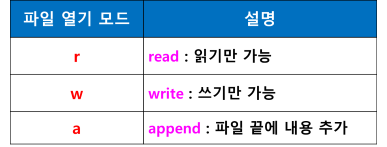

# 파일 입출력
- 파일 생성하기
- 파일에 쓰기
- 파일 읽기
- 파일에 추가하기
- with 문과 함께 사용하기

## 파일 입출력 작업을 하기 위해서  open() 함수 사용
- 파일 객체 = open(파일명, 파일 열기 모드)
- 파일이 저장된 곳 참조 (포인터 역할)
- 파일 열기 모드에 따라 파일 생성/읽기/쓰기/추가 기능 수행



## 파일 닫기 (close())
- 파일 작업이 끝나면 close() 함수로 열려 있는 파일 객체를 닫는다
- 프로그램 종료 시 열려 있는 파일 객체는 자동으로 닫히지만
- 쓰기 모드로 연 파일을 닫지 않고 다시 작업할 경우 에러가 발생
- close()로 닫는 것이 좋다

## 파일 생성
- 파일을 쓰기 모드(w)로 연다
- 해당 파일이 존재하지 않으면 새로 생성하고 존재하면 덮어 씀 (기존 내용 없어짐)
- 파일 객체 = open(“파일명”, ‘모드”)
```python
f = open(“file1.txt”, ‘w’)
f.close()
```

## 파일에 쓰기
- 파일을 쓰기 모두(w)로 열고
- 파일 객체의 write() 메소드로 출력값을 파일에 기록
- f.write(데이터)

## 파일 읽기 방법
- readline() 
- 1개 행씩 읽어 오기
- 1행 끝에 ‘\n’ 포함
- readlines() : 
    - 모든 행을 읽어 라인 별로 잘라서 리스트 생성
    - 1개 행이 1개 요소
    - [‘..’, ‘…’, ‘…’, …, ‘…’]
- read()
    - 내용 전체를 읽어서 문자열로 반환

## 파일 끝에 데이터 추가 : 파일 열기 모드 ‘a’
- 파일을 쓰기 모드(w)로 여는 경우
- 해당 파일이 존재하지 않으면 새로 생성하고 존재하면 덮어 씀 (기존 내용 없어짐)
- 파일 끝에 추가하려면 이전 내용 그대로 유지하면서 파일 끝에 새로운 내용 추가하려면
- 파일 열기 모드 : ‘a’로 지정
    - append

## with 문으로 파일 열기
- with 문
```python
with open(파일명, 열기 모드) as 파일 객체:
수행 문장
```
- with 문이 종료되면 파일 객체 자동으로 close()
- close() 안 해도 됨