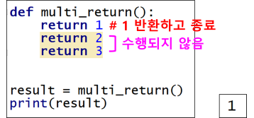

# 함수 (function)
- 특정 작업을 수행하는 코드 집합
- 기능 / 작업 / 일
- 복잡한 기능을 특정 기능에 맞춰 분리해 놓은 코드 집합
- 분업

## 함수 사용 이유
- 코드 재사용 : 한 번 만들어 놓고 여러 번 사용
- 중복된 코드 제거 
    - 동일 내용의 코드를 여러 번 적을 필요 없이 함수로 만들어 필요한 곳에서 사용
- 작업 분해
    - 복잡하고 긴 내용을 기능별로 분리해서 함수로 만들어 사용

## 함수 사용의 장점
- 경제적 (코드 재사용)
- 프로그램 가독성 증대 (작업 분해)
- 프로그램의 유지 관리 용이
    - 변경 사항 발생 시 해당 함수만 수정 작업

## 함수의 종류
- 내장 함수
    - 파이썬에 이미 만들어져 있는 함수들
    - 형식에 맞춰 함수이름만 호출해서 사용
    - print(), input(), type(), dir(), abs(), …
    - 특정 객체를 통해 사용 가능한 함수(메소드)
        - 문자열.sort(), 문자열.split(), 리스트.insert()
- 사용자 정의 함수
    - 사용자가 임의로 만들어서 사용하는 함수

## 함수 구조
```pythyon
def 함수명 :
    수행문장
    반환값(생략 가능)

def add(n1, n2) : 
	print(n1, n2)
	return n1 + n2
```
- 콜론(:), 들여쓰기 주의

## 함수명
- 함수의 목적을 설명하는 동사
- 또는 동사 + 명사를 사용
- square(num)			// 정수를 제곱하는 함수
- compute_average(list)	// 평균을 구하는 함수
- set_cursor_type(c)		// 커서의 타입 설정
- showResult()			//결과 출력
    - 파이참에서는 함수 이름은 소문자 사용 권장
    - 파이썬에서는 낙타체보다 show_result() 주로 사용

## 함수 사용
- 함수를 사용하려면 함수를 호출(call)해야 한다
- 함수 호출 : 함수이름을 적는다
- 함수는 호출하지 않으면 아무 일도 하지 않음
- 주의!
    - 함수를 호출하기 전에 먼저 함수를 정의해야 한다

## 반환값이 있는 함수
- 함수의 반환값
- 함수가 특정 기능을 수행하고 돌려 주는 결과값

### 결과값 반환
- return 문 사용
- 함수가 호출된 곳으로 반환 (함수이름이 있는 곳으로 반환)

## 여러 개의 값 반환
- 파이썬을 제외한 다른 많은 프로그래밍 언어에서 함수는 항상 하나의 값만 반환 
    - return x (가능)
    - return x, y (불가능)
    - 여러 개의 값을 반환할 때는 배열 사용
- 파이썬에서는 함수가 여러 개의 값을 반환할 수 있음
    - return 1, 2, 3
    - 반환되는 여러 개의 값을 각 변수에 저장 가능
    - a, b, c = f1()
    - t  = fi() # t는 튜플로 생성

## return 주의!
- return 문이 여러 개 있으면 첫 번째 return 문만 수행
- 두 번째 이하 return 문은 수행되지 않음
- 함수는 return 문을 만나면
    - 값을 반환
    - 함수 종료 (함수 끝)



## 매개변수가 있는 함수
- 매개변수 (parameter)
    - 함수로 전달되는 값을 받는 변수
    - 함수 내에서 지역변수로 사용
    - def add(n1 n2):
    - n1, n2 : 매개변수
- 인수 (argument)
    - 함수에게 실제로 전달되는 값
    - add(3, 4)  / add(x, y)
    - 3, 4 / x, y가 인수

## 함수로 리스트 전달
- 함수에게 리스트를 매개변수로 전달하면 리스트를 복사하여 매개변수가 받음
    - 얕은 복사 (주소 복사) : 동일한 리스트 공유
    - 함수 내에서 전달받은 리스트를 변경하면 원본 리스트도 변경됨

## 디폴트 매개변수
- 매개변수에 기본값 지정
    - def greet(name, msg=”안녕”):
- 디폴트 매개변수는 마지막에 위치

## 가변길이 매개변수 (*args / **kwargs)
- Variadic Parameter
- variable length parameter
- 1개의 매개변수로 개수가 정해지지 않은 여러 개의 값을 전달 받을 때 사용하는 매개변수
- *args 
    - arguments의 약자
    - 인수 값을 받음
    - *args 대신 다른 이름 사용 가능
        - *names, *numbers, …
    - def add(*args): # 함수 정의
    - 호출
        - add(1, 2)
        - add(1, 2, 3, 4)
- **kwargs
    - KeyWord arguments의 약자
    - key=value 값을 받음
    - **kwargs 대신 다른 이름 사용 가능
        - **names, **numbers, …
    - def info(**kwargs): # 함수 정의
    - 호출
        - info(id=”abcd”)
        - info(id=”abcd”, name=”kim)

## 인수
### 위치 인수 (positional arguments) (일반적인 인수)
- 함수 호출 시 위치에 의하여 구별하는 방식
- 매개변수의 순서대로 인수를 전달하여 사용하는 경우
- 순서대로 전달 (매개변수가 순서대로 받음)
- add(a, b, c)
- 호출 : add(10, 20, 30)

### 키워드 인수 (keyword arguments)
- 인수 앞에 키워드를 두어서 인수를 구별하는 방식
- 인수의 위치가 매개변수의 위치와 달라도 됨
- 호출 
- add(c=30, a=10, b=20)

### 주의!
- 위치 인수와 키워드 인수를 섞어서 사용해도 되지만 위치 인수를 키워드 인수 보다 앞에 두어야 한다
- 호출 
- add(10, c=30, b=20) : 위치 인수가 앞에 와야 함
- add(c=30, 20, 10) : 오류
키워드 뒤에 위치 인수가 올 수 없음

## 지역 변수 (local variable)
- 함수 내부에서 정의된 변수
- 함수 내에서만 사용 가능
- 함수 호출 시 생성되고 함수가 종료되면 소멸되어 더 이상 사용할 수 없음
- 함수의 매개변수도 지역 변수 
    - 외부로부터 값을 전달 받아 함수 내부에서만 사용하는 지역 변수

## 전역 변수 (global variable)
- 함수 외부에서 정의된 변수
- 프로그램 내 모든 곳에서 사용 가능
- 함수 내에서 전역 변수의 값을 변경하려면 global 키워드 사용
    - a = a + 1 # a의 값 변경 
        - global 키워드로 지정하지 않으면 변경 불가
    - global a
    - a = a + 1 # a의 값 변경 가능
- 주의!
    - 전역변수 사용하려면 함수 호출(사용) 전에 정의되어 있어야 함

