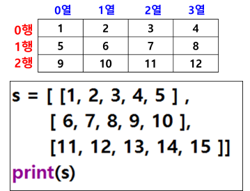

# 리스트(List)
- 동일한 이름을 갖는 원소들의 연속 저장 영역
- 여러 개의 데이터가 저장되어 있는 장소 (집합적 자료형)
- 각 원소는 인덱스(Index)로 구분(인덱스: 0부터 시작)
- 원소(값) 변경 가능
- 대괄호 [ ] 사용
- 리스트 = [값1, 값2, . . . ]
- scores  = [ 32, 56, 64, 72, 12]

## 리스트의 특징
- 리스트의 크기는 가변적
- 다양한 종류의 데이터를 하나의 리스트 안에 저장 가능
- myList = [12, "dog", 180.14] 	
- myList = [12, "dog", 180.14, “홍길동”]

## 특정 원소에 접근 : 인덱싱(indexing)
- 특정 원소에 접근 : 인덱싱(indexing)
- 리스트에서 인덱스 연산자를 통하여 요소를 참조(접근)하는 것
- a = [1, 2, 3, 4, 5]
- a[0] : 첫 번째 요소 (1)
- a[-1] : 뒤에서 첫 번째 요소 (마지막 요소) (5)
- a[-2] : 뒤에서 두 번째 요소 (4)
- b = [1, 2, 3, [10, 20]]
- b[-1][0] : 마지막 요소의 첫 번째 요소 (10)

## 슬라이싱(slicing)
- 리스트 안에서 범위를 지정하여서 원하는 요소들을 선택하는 연산
- 리스트[start:end] : start에서 end-1 요소까지 선택
- [start:end:step] : start에서 end-1 범위에서 간격2
- 리스트[0:n] : 0부터 n-1번째까지의 요소 
- 리스트[n:] : n부터 끝까지
- 리스트[:n] : 0부터 n-1까지
- 리스트[-1:] : 마지막 요소 (마지막에서 끝까지)
- 리스트[:-1] : 처음부터 마지막-1까지
- 리스트 [:] : 전체 요소 
- 문자열 슬라이싱과 동일

## 리스트 복사
### 리스트 변수 
- 객체 참조 변수
- 리스트(객체) 자체는 다른 곳에 저장되어 있고
- 참조값(reference)만 변수에 저장 
- 참조값 : 메모리에서 리스트 객체의 위치(주소)

### 리스트 복사 방식
- 얕은 복사 (shallow copy)
    - 실제 리스트는 복사되지 않고 참조값(주소)만 복사
    - 동일한 주소의 리스트를 공유
    - 복사본 리스트의 요소 값을 변경하면 원본 리스트 요소의 값도 변경
    - scores = [10, 20, 30]
    - copies = scores
- 깊은 복사 (deep copy)
    - 리스트의 복사본을 새로 생성해서 반환
    - 복사본의 리스트 원소의 값을 변경하여도 원본 리스트 원소의 값은 변경되지 않음
    - list() 함수 또는 deepcopy() 함수를 사용
    - scores = [10, 20, 30]
    - copies = list(scores)
    - copies = copy.deepcopy(scores)

## 메소드
- 함수와 같은 코드 집합이지만 클래스의 멤버로 객체를 통해서만 사용 가능
-  append() / insert() / remove() / count() ..
- 사용법 : 객체.메소드()
- names.append(), names.count()

## 리스트 주요 메소드(함수)
### (1) len() 내장 함수
- 리스트의 길이 반환 (원소의 개수)
- len(리스트)
- a = [1, 2, 3, 4, 5]
- len(a) : 5

### (2) count() 
- 리스 내에서 특정 요소의 개수 세기
- a = [1, 2, 3, 3, 4]
- a.count(3) : 3의 개수 반환 (2개)

### (3) append()
- 리스트의 끝에 새로운 요소 추가
- 리스트.append()

### (4) insert()
- 리스트의 특정 위치에 요소 삽입 
- 리스트.insert(위치, 값)

### (5) remove()
- 리스트에서 값에 해당되는 요소 제거
- 리스트.remove(값)
- 동일한 값이 여러 개 있는 경우 첫 번째 값만 제거
- 다 제거하려면 for 문 사용
- 전부 삭제했는데 또 삭제하면 오류
- 요소 개수 확인하고, 개수만큼 반복
- 모든 요소 제거 : clear() (빈 리스트만 남음)

### (6) pop() : 꺼내오다
- 리스트.pop() : 리스트의 마지막 요소 반환하고 삭제
- 리스트.pop(인덱스)
- 인덱스 위치에 있는 요소 반환하고 삭제

### (7) clear()
- 리스트의 모든 요소 제거
- 빈 리스트만 남음

### (8) extend()
- 리스트 확장
- 리스트.extend()
- 이전 리스트에 원소 추가하여 확장된 리스트로 됨
- 원래 리스트 변경됨
- a = [1, 2, 3]
- a.extend([4,5]) 
- a = [1, 2, 3, 4, 5]
- 리스트를 더하기 연산한 것과 동일
- append()와 insert()에서는 하위 리스트로 추가됨

### (9) sort()
- 리스트의 원소들 정렬 (기본 : 오름차순)
- 원본 리스트 변경
- 리스트.sort()   / sort(reverse=True) : 내림차순

### (10) reverse()
- 역순으로 원본 리스트 변경 (정렬은 하지 않고 순서만 반대로)
- 리스트.reverse()

### (11) sorted() : 파이썬 내장 함수
- 원본 유지하면서
- 정렬된 새로운 리스트 반환
- sorted(리스트)

### (12) max()
- 리스트 내에서 최대값 원소 반환

### (13) min()
- 리스트 내에서 최소값 원소 반환

### (14) index()
- 리스트 안에서 원소의 위치 값 반환
- 원소가 존재하지 않으면 에러
- 리스트.index(값)
- a = [1, 2, 3, 4, 5]
- a.index(3) : 2 반환
- a.index(10) : 에러

## join() 사용해서 리스트 각 항목을 문자열로 변환
- ‘구분자’.join(리스트)

## in / not in (포함 여부)
- 리스트 내에서 원소의 존재 여부 반환 : True / False
    - in : 존재하면 True 반환
    - not it : 존재하지 않으면 True 반환

## 리스트 일치 검사
- 비교 연산자를 사용하여 2개의 리스트 비교
- ==, !=, >, < 등
- 첫 번째 요소부터 비교 시작
- 첫 번째 요소의 비교에서 결과가 False 이면 더 이상 비교하지 않고 종료
- 첫 번째 요소가 동일하면 두 번째 요소 비교 … 
- 리스트 안의 모든 요소 비교 결과가 True이면
- 전체 결과가 True
- l1 = [1, 2, 3]
- l2 = [1, 2, 3]
- l1 = l2 # True

## 2차원 리스트
- 2차원 테이블 형태

## 리스트 안에 for문 포함
- 반복한 결과를 리스트로 생성해서 저장
- 리스트 = [n   for n in 리스트   ] 