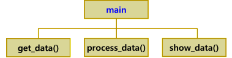
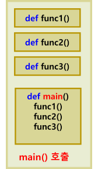

# main() 함수
- 일반적으로 프로그래밍 언어 (C, Java)에서
- 프로그램 시작될 때 제일 먼저 자동으로 호출되는 함수
- 전체 프로그램이 main()에 있는 순서대로 수행됨
- 파이썬에서는 main() 함수가 정의되어 있지 않지만  프로그램 실행시켰을 때 main() 함수가 동작하는 것처럼 작성 가능
```python
__name__ 변수 사용 : “__main__” (변수 값)
```
- 모듈이 이름을 담고 있는 파이썬 내장 변수 (스페셜 변수)

## 함수를 사용한 프로그램 설계
- 문제 분해
    - 문제를 한 번에 해결하려고 하지 말고 더 작은 크기의 문제들로 분해
    - 문제가 충분히 작아질 때까지 계속해서 분해 
- 함수로 작성
    - 문제가 충분히 작아지면 각각의 문제를 함수로 작성 
- 함수 조립
    - 이들 함수들을 조립하면 최종 프로그램 완성 



-  main() 함수 사용할 경우 모듈의 구조



