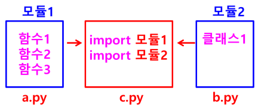
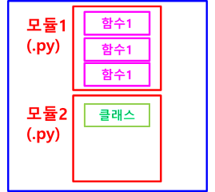

# 모듈 (Module)
- 함수, 변수, 클래스 들을 모아 놓은 파일 (.py)

## 모듈 사용
- 하나의 파일에 모든 코드를 넣지 않음
- 기능별로 함수, 클래스 단위로 별도의 파일을 만들어 놓은 후 필요한 곳에서 import 해서 사용



## 함수 / 모듈 / 패키지 포함 관계
- 함수 : 특정 기능을 수행하는 코드 집합
- 모듈 : 함수들을 모아 놓은 파일 (.py)
- 패키지 : 여러 모듈들을 모아 놓은 디렉터리



## 모듈을 사용하는 이유
- 코드의 재사용 (경제적)
    - 자주 사용되는 함수를 한 번 작성해 놓고 여러 곳에서 import 해서 사용
- 효율적
    - 코드를 기능에 따라 모듈 단위로 분리하여 설계함으로써 효율적인 개발 및 유지보수 가능
    - 독립적인 네임스페이스 (이름 공간) 
    - 모듈마다 서로 다른 영역이므로, 동일한 이름의 함수나 변수들을 각 모듈에서 사용 가능 

## 모듈의 종류
- 표준 모듈
    - 파이썬 언어 패키지 안에 기본으로 포함되어 있는 모듈
    - 예: math, string
- 사용자 정의 모듈
    - 개발자가 직접 정의한 모듈
- 서드파티 모듈
    - 다른 업체나 개인이 만들어서 제공하는 모듈

## 모듈 선언 방법
### 모듈 전체 참조
- import 모듈명(파일명) : import math
- import 모듈명 as 별칭
    - 모듈명이 길거나 모듈명이 동일한 경우 별칭 사용
    - import pandas as pd
    - import numpy as np
- 모듈 내 함수를 참조할 경우
    - 모듈명.함수명() : math.pow()
```python
import random
n = random.randrange(5)
```

### 모듈 내에서 일부만 참조
- from 모듈명 import 변수명 or 함수명
    - from datetime import date, datetime, timedelta
- from 모듈명 import 함수명 as 별칭
- from 모듈명 import *
    - 모듈 내에서 ‘__’ 시작하는 스페셜 변수나 매직 메소드를 제외한 모든 것 참조 가능

