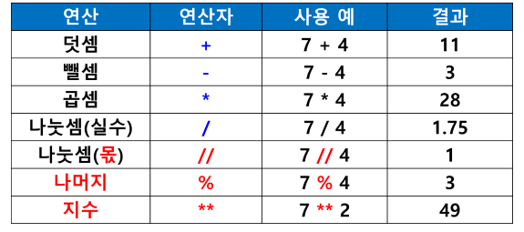
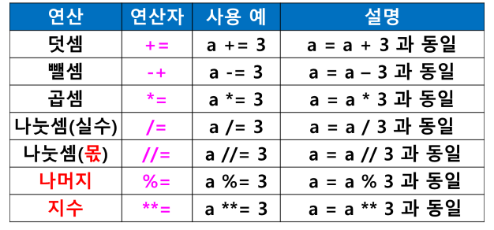
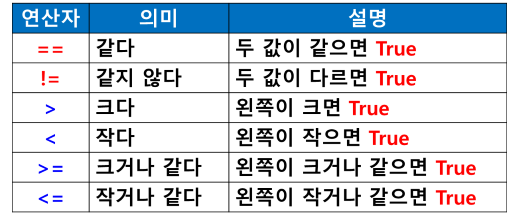
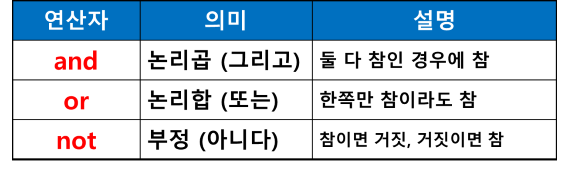

# 연산자 (Operators)
## (1) 산술 연산자

### 산술 연산자 우선순위
- (1) 괄호 ()
- (2) 지수 **
- (3) 곱셈 *, 나눗셈 / , 나머지 %
- (4) 덧셈 +, 뺄셈 -

### 누적 대입 연산자

## (2) 관계 연산자
- 두 값을 비교하여 결과 반환
- 결과는 True / False

## (3) 논리 연산자

