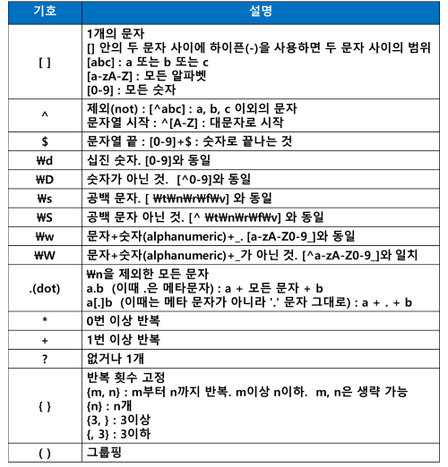

# 정규식 표현식 (Regular Expressions)
- 특정 규칙을 가진 문자열의 집합을 표현하는 언어
- 복잡한 문자열을 처리할 때 사용하는 기법
- 파이썬에서 정규 표현식 지원 : re 모듈

## re 모듈의 메소드
- (1) compile()
    - 정규표현식을 컴파일하여 패턴 객체를 반환 
    - p = re.compile(‘[a-z]+’)
    - result = p.search(“문자열”)
- (2) findall()
    - 전체 문자열에서 패턴과 일치하는 모든 문자열을 찾아 리스트로 반환
- (3) serch()
    - 전체 문자열에서 패턴과 일치하는 첫번째 문자열을 찾아 매치 객체로 반환
    - 문자열의 중간에라도 일치하는 패턴이 있다면 이를 매치 
- (4) match()
    - 전체 문자열에서 시작부터 패턴과 일치하는 첫번째 문자열을 찾아 매치 객체로 반환합
    - 반드시 문자열의 처움부터 일치해야만 이를 매치 
- (5) finditer()
    - 전체 문자열에서 패턴과 일치하는 모든 문자열을 찾아 리스트로 반환
- (6) group()
    - 매치된 문자열 반환 
- (7) start()
    - 매치된 문자열의 시작 위치 반환 
- (8) end()
    - 매치된 문자열의 끝 위치 반환 
- (9) span()  
    - 매치된 문자열의 (시작, 끝)에 해당하는 튜플 반환