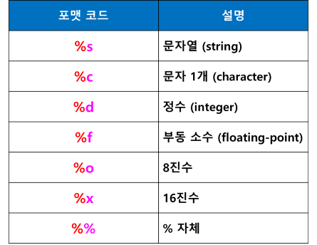

# 변수 (variable)
- 값을 저장하기 위한 메모리 내의 기억 장소

## 변수에 값 저장
- 변수 = 값
- x = 10

## 파이썬의 변수
- 값(객체)이 저장된 메모리의 위치를 가리키는 레퍼런스 (객체 참조 변수)
- 변수 x에 값 저장의 의미
- x = 10

- 변수는 객체를 참조하는 이름표잉고 실제 데이터는 객체 안에 저장되어 있음
- print(변수) 
    - 변수가 가리키는 객체의 값 출력
    - print(x)
- id(x)
    - 변수가 가리키는 메모리의 주소(특정값) 반환
    - print(id(x))

## 파이썬 변수의 특징
- 변수 선언 필요 없음
    - 필요한 데서 변수 만들어서 값 저장하면 됨
- 변수의 저장된 값의 형(타입)에 따라 
    - 실행 시점에서 동적으로 형(type) 검사
    - 동적 타이핑 (dynamic typing)
- 변수의 자료형이 정해져 있지 않다
    - 정수를 저장하면 int 타입
    - 실수를 저장하면 float 타입
    - 문자열 저장하면 str 타입
- 변수에는 다른 값을 저장할 수 있다 (값 변경 가능)

## 변수명
- 대소문자 구분
- 변수명은 영문자와 숫자, 밑줄(_)로 구성 (숫자로 시작하지 않음)
- 변수명 중간에 공백 허용하지 않음 
- 변수명 예
    - std_name
    - stdName
- 예약어(키워드) 사용할 수 없음
     - 예약어 (Reserved Words) / 키워드 (Keyword)
    - 이미 용도가 정해져(예약된) 있는 단어
    - 변수명 또는 함수명 등의 식별자로 사용할  수 없음
    - 식별자
        - 변수, 상수, 함수, 사용자 정의 타입(클래스) 등에서
        - 다른 것과 구분하기 위해 사용되는 이름
        - 변수명, 상수명, 함수명, 클래스명 등

### 예약어 확인 (참고)
- import keyword
- print(keyword.kwlist)
- ['False', 'None', 'True', 'and', 'as', 'assert', 'async', 'await', 'break', 'class', 'continue', 'def', 'del', 'elif', 'else', 'except', 'finally', 'for', 'from', 'global', 'if', 'import', 'in', 'is', 'lambda', 'nonlocal', 'not', 'or', 'pass', 'raise', 'return', 'try', 'while', 'with', 'yield']

## 변수에 값 저장
- 변수 = 값
- a = 10

## 여러 개의 변수에 여러 개의 값 저장
- 변수1, 변수2, 변수3 = 값1, 값2, 값3, 값4
- a, b, c = 1, 2, 3

## 여러 개의 변수에 한 개의 값 저장
- 변수1 = 변수2 = 변수3 = 10
- a = b = c = 10

## 두 변수의 값 교환 (swap)
### 다른 언어에서의 두 변수의 값 교환
- a = 10
- b = 20
- a = b # 20이 a에 저장되면서 이전의 값10은 없어짐 (떺어씀)
- 임시 변수 (temp) 사용
- temp = a
- a = b
- b = temp

### 파이썬에서의 두 변수의 값 교환 
- 변수1, 변수2 = 변수2, 변수1
- a, b = b, a

## 변수 삭제
- del 명령어 사용
- del 변수
- del a
- 삭제 후 사용하면 오류 발생 : not defined

## 문자열 변수
- 큰따옴표, 작은따옴표 다 사용 가능
- 문자열 연결 연산자 : +
- 주의! 
    - 문자열과 숫자는 연결할 수 없다
    - 숫자를 문자열로 형변환 필요 : str() 함수 사용

## 포맷 코드 사용
- print() 함수에서 문자열과 변수를 함께 출력할 때 
- 방법1 : print(“문자열”, 변수)
- 방법2: 포맷 코드 사용
    - print(“서식” % 값)
    - print(“문자열 %d  문자열” % 변수)
    - print(“나이 %d  살” % age)
    - print(“내 이름은 %s  입니다” % name)

### 2개의 변수 출력 시 : 여러 개의 변수를 반드시 괄호로 묶는다
- print("%d, %.2f" % (total, average))

### 퍼센트로 %로 출력 : %%
- print("출력률 : %d%%" % rate)

## format() 함수 사용
- 문자열에 {}로 위치 지정하고
    - format(변수, 변수,...)로 지정
- 위치 지정 시 {}안에 숫자 지정 가능
    - “....{0}.....{1}....{2}...”